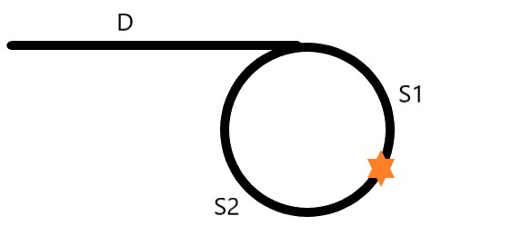

## 142. Linked List Cycle II
>https://leetcode-cn.com/problems/linked-list-cycle-ii/

### 描述
给定一个链表，返回链表开始入环的第一个节点。 如果链表无环，则返回 null。

为了表示给定链表中的环，我们使用整数 pos 来表示链表尾连接到链表中的位置（索引从 0 开始）。 如果 pos 是 -1，则在该链表中没有环。

说明：不允许修改给定的链表。

### 思路一：set集合
- 定义一个set存储节点
- 遍历节点，如果已经在set中说明该节点之前已经遍历过，即存在环，返回这个结点；没有则将其添加到set中
- 如果遍历完成都没有存在set中，则说明无环
- 需要遍历一次整个列表，时间复杂度O(n)
- 需要定义一个set存储整个列表，空间复杂度O(n)

#### 代码实现
```python
class Solution:
    def detectCycle(self, head: ListNode) -> ListNode:
        node_set = set()
        while head and head.next:
            if head in node_set:
                return head
            node_set.add(head)
            head = head.next
        return None
```

### 思路二：快慢指针

- 定义一个快指针，每次走两步，一个慢指针，每次走一步
- 其中 * 表示快慢指针首次相遇点，假设头结点到入环结点的距离为 D，慢指针入环后走过的距离为S1，环剩余距离为S2，快指针入环后走过的距离为S1 + n(S1+S2)，其中n为所走的圈数
- 则有，慢指针行走的距离为S = D + S1
- 快指针行走的距离为F = D + S1 + n(S1+S2)
- 又有 F = 2S
- 各种移项可得 D = (n-1)S1 + nS2 = (n-1)(S1 + S2) + S2
- 即头结点到入环的距离 n圈 + S2，不管n是多少，该点就是入环点
- 让快指针重新从头出发，每次走一步，慢指针在 * 开始移动，每次走一步，当他们相遇时，所在的位置就是入环点

#### 代码实现
```python
# Definition for singly-linked list.
# class ListNode:
#     def __init__(self, x):
#         self.val = x
#         self.next = None

class Solution:
    def detectCycle(self, head: ListNode) -> ListNode:
        slow = fast = head
        while fast and fast.next:
            fast,slow = fast.next.next,slow.next
            if slow == fast:
                fast = head
                while fast != slow:
                    fast, slow = fast.next, slow.next
                return fast
        return None
```
```go
/**
 * Definition for singly-linked list.
 * type ListNode struct {
 *     Val int
 *     Next *ListNode
 * }
 */
func detectCycle(head *ListNode) *ListNode {
    slow, fast := head, head 
    for fast != nil && fast.Next != nil {
        fast = fast.Next.Next
        slow = slow.Next
        if slow == fast {
            fast = head
            for fast != slow {
                fast, slow = fast.Next, slow.Next
            }
            return fast
        }
    }
    return nil
}
```


