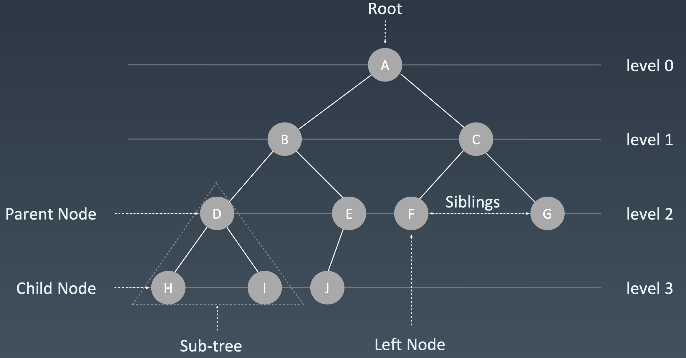

# 树


- 这里面每个元素我们叫做“节点”；
- 用来连接相邻节点之间的关系，我们叫做“父子关系”，父节点和子节点。
- 父节点是同一个的节点之间互称为兄弟节点
- 没有父节点的节点叫做根节点，也就是图中的节点 A。
- 没有子节点的节点叫做叶子节点或者叶节点

## 高度（Height）、深度（Depth）、层（Level）
- 节点的高度 = 节点到叶子节点的最长路径（边数）
- 节点的深度 = 根节点到这个节点所经历的边的个数
- 节点的层数 = 节点的深度 + 1
- 树的高度 = 根节点的高度


# 二叉树（Binary Tree）
二叉树，顾名思义，每个节点最多有两个“叉”，也就是两个子节点，分别是左子节点和右子节点。不过，二叉树并不要求每个节点都有两个子节点，有的节点只有左子节点，有的节点只有右子节点。


- 其中，编号 2 的二叉树中，叶子节点全都在最底层，除了叶子节点之外，每个节点都有左右两个子节点，这种二叉树就叫做**满二叉树**。
- 编号 3 的二叉树中，叶子节点都在最底下两层，最后一层的叶子节点都靠左排列，并且除了最后一层，其他层的节点个数都要达到最大，也就是说最后一层的子节点，从 左数到右是连续，中间没有断开，缺少节点，这种二叉树叫做**完全二叉树**。


## 如何表示（或者存储）一棵二叉树
- 基于指针或者引用的二叉链式存储法
- 基于数组的顺序存储法。

### 链式存储法
每个节点有三个字段，其中一个存储数据，另外两个是指向左右子节点的指针。

这种存储方式比较常用。大部分二叉树代码都是通过这种结构来实现的。


### 顺序存储法
把根节点存储在下标 i = 1 的位置，那左子节点存储在下标 2 * i = 2 的位置，右子节点存储在 2 * i + 1 = 3 的位置。以此类推，B 节点的左子节点存储在 2 * i = 2 * 2 = 4 的位置，右子节点存储在 2 * i + 1 = 2 * 2 + 1 = 5 的位置。

- 如果节点 X 存储在数组中下标为 i 的位置，下标为 2 * i 的位置存储的就是左子节点，下标为 2 * i + 1 的位置存储的就是右子节点。
- 反过来，下标为 i/2 的位置存储就是它的父节点。

但是如果是非完全二叉树，其实会浪费比较多的数组存储空间。


如果某棵二叉树是一棵**完全二叉树**，那用数组存储无疑是最节省内存的一种方式。因为数组的存储方式并不需要像链式存储法那样，要存储额外的左右子节点的指针。这也是为什么完全二叉树会单独拎出来的原因，也是为什么完全二叉树要求最后一层的子节点都靠左的原因。

堆其实就是一种完全二叉树，最常用的存储方式就是数组。

## 二叉树的遍历
- 前序遍历(Pre-order):根-左-右
- 中序遍历(In-order):左-根-右
- 后序遍历(Post-order):左-右-根
>其中，前、中、后序，表示的是节点与它的左右子树节点遍历打印的先后顺序。

前序遍历是指，对于树中的任意节点来说，先打印这个节点，然后再打印它的左子树，最后打印它的右子树。
中序遍历是指，对于树中的任意节点来说，先打印它的左子树，然后再打印它本身，最后打印它的右子树。
后序遍历是指，对于树中的任意节点来说，先打印它的左子树，然后再打印它的右子树，最后打印这个节点本身。

从图中可以看出来，每个节点最多会被访问两次，所以遍历操作的时间复杂度，跟节点的个数 n 成正比，也就是说二叉树遍历的时间复杂度是 O(n)。

### 树的递归
前序遍历的递推公式：
preOrder(r) = print r->preOrder(r->left)->preOrder(r->right)

中序遍历的递推公式：
inOrder(r) = inOrder(r->left)->print r->inOrder(r->right)

后序遍历的递推公式：
postOrder(r) = postOrder(r->left)->postOrder(r->right)->print r

```python
def preorder(self, root):
    if root: 
        self.print(root.val) 
        self.preorder(root.left) 
        self.preorder(root.right)
def inorder(self, root):
    if root:
        self.inorder(root.left) 
        self.traverse_path.append(root.val) 
        self.inorder(root.right)
def postorder(self, root):
    if root:
        self.postorder(root.left) 
        self.postorder(root.right) 
        self.traverse_path.append(root.val)
```

# 二叉查找树（Binary Search Tree）
二叉查找树是二叉树中最常用的一种类型，也叫二叉搜索树、有序二叉树(Ordered Binary Tree)、排序二叉树(Sorted Binary Tree)。顾名思义，二叉查找树是为了实现快速查找而生的。
## 要求
二叉查找树要求，在树中的任意一个节点，其左子树中的每个节点的值，都要小于这个节点的值，而右子树节点的值都大于这个节点的值

## 二叉查找树的查找操作
如何在二叉查找树中查找一个节点。
- 先取根节点，如果它等于要查找的数据，那就返回。
- 如果要查找的数据比根节点的值小，那就在左子树中递归查找
- 如果要查找的数据比根节点的值大，那就在右子树中递归查找。


```java

public class BinarySearchTree {
  private Node tree;

  public Node find(int data) {
    Node p = tree;
    while (p != null) {
      if (data < p.data) p = p.left;
      else if (data > p.data) p = p.right;
      else return p;
    }
    return null;
  }

  public static class Node {
    private int data;
    private Node left;
    private Node right;

    public Node(int data) {
      this.data = data;
    }
  }
}
```
## 二叉查找树的插入操作
新插入的数据一般都是在叶子节点上，所以只需要从根节点开始，依次比较要插入的数据和节点的大小关系。

- 如果要插入的数据比节点的数据大，并且节点的右子树为空，就将新数据直接插到右子节点的位置；
- 如果不为空，就再递归遍历右子树，查找插入位置。
- 同理，如果要插入的数据比节点数值小，并且节点的左子树为空，就将新数据插入到左子节点的位置；
- 如果不为空，就再递归遍历左子树，查找插入位置。

```java

public void insert(int data) {
  if (tree == null) {
    tree = new Node(data);
    return;
  }

  Node p = tree;
  while (p != null) {
    if (data > p.data) {
      if (p.right == null) {
        p.right = new Node(data);
        return;
      }
      p = p.right;
    } else { // data < p.data
      if (p.left == null) {
        p.left = new Node(data);
        return;
      }
      p = p.left;
    }
  }
}
```

## 二叉查找树的删除操作

针对要删除节点的子节点个数的不同，需要分三种情况来处理。
- 第一种情况是，如果要删除的节点没有子节点，我们只需要直接将父节点中，指向要删除节点的指针置为 null。比如图中的删除节点 55。
- 第二种情况是，如果要删除的节点只有一个子节点（只有左子节点或者右子节点），我们只需要更新父节点中，指向要删除节点的指针，让它指向要删除节点的子节点就可以了。比如图中的删除节点 13。
- 第三种情况是，如果要删除的节点有两个子节点，这就比较复杂了。我们需要找到这个节点的右子树中的最小节点，把它替换到要删除的节点上。然后再删除掉这个最小节点，因为最小节点肯定没有左子节点（如果有左子结点，那就不是最小节点了），所以，我们可以应用上面两条规则来删除这个最小节点。比如图中的删除节点 18。

```java

public void delete(int data) {
  Node p = tree; // p指向要删除的节点，初始化指向根节点
  Node pp = null; // pp记录的是p的父节点
  while (p != null && p.data != data) {
    pp = p;
    if (data > p.data) p = p.right;
    else p = p.left;
  }
  if (p == null) return; // 没有找到

  // 要删除的节点有两个子节点
  if (p.left != null && p.right != null) { // 查找右子树中最小节点
    Node minP = p.right;
    Node minPP = p; // minPP表示minP的父节点
    while (minP.left != null) {
      minPP = minP;
      minP = minP.left;
    }
    p.data = minP.data; // 将minP的数据替换到p中
    p = minP; // 下面就变成了删除minP了
    pp = minPP;
  }

  // 删除节点是叶子节点或者仅有一个子节点
  Node child; // p的子节点
  if (p.left != null) child = p.left;
  else if (p.right != null) child = p.right;
  else child = null;

  if (pp == null) tree = child; // 删除的是根节点
  else if (pp.left == p) pp.left = child;
  else pp.right = child;
}
```
## 二叉查找树的其他操作
二叉查找树中还可以支持快速地查找最大节点和最小节点、前驱节点和后继节点。
中序遍历二叉查找树，可以输出有序的数据序列，时间复杂度是 O(n)，非常高效。因此，二叉查找树也叫作二叉排序树。


## 时间复杂度分析
### 最坏情况
根节点的左右子树极度不平衡，已经退化成了链表，所以查找的时间复杂度就会变成 O(n)

### 最理想的情况
二叉查找树是一棵完全二叉树（或满二叉树），不管操作是插入、删除还是查找，时间复杂度其实都跟树的高度成正比，也就是 O(height)。
包含 n 个节点的完全二叉树中，第一层包含 1 个节点，第二层包含 2 个节点，第三层包含 4 个节点，依次类推，下面一层节点个数是上一层的 2 倍，第 K 层包含的节点个数就是 2^(K-1)。
借助等比数列的求和公式，可以计算出，完全二叉树的层数小于等于 log2n +1，也就是说，完全二叉树的高度小于等于 log2n。（与跳表计算方式差不多）

# 散列表和二叉搜索树
- 第一，散列表中的数据是无序存储的，如果要输出有序的数据，需要先进行排序。而对于二叉查找树来说，我们只需要中序遍历，就可以在 O(n) 的时间复杂度内，输出有序的数据序列。
- 第二，散列表扩容耗时很多，而且当遇到散列冲突时，性能不稳定，尽管二叉查找树的性能不稳定，但是在工程中，最常用的平衡二叉查找树的性能非常稳定，时间复杂度稳定在 O(logn)。
- 第三，笼统地来说，尽管散列表的查找等操作的时间复杂度是常量级的，但因为哈希冲突的存在，这个常量不一定比 logn 小，所以实际的查找速度可能不一定比 O(logn) 快。加上哈希函数的耗时，也不一定就比平衡二叉查找树的效率高。
- 第四，散列表的构造比二叉查找树要复杂，需要考虑的东西很多。比如散列函数的设计、冲突解决办法、扩容、缩容等。平衡二叉查找树只需要考虑平衡性这一个问题，而且这个问题的解决方案比较成熟、固定。
- 最后，为了避免过多的散列冲突，散列表装载因子不能太大，特别是基于开放寻址法解决冲突的散列表，不然会浪费一定的存储空间。


