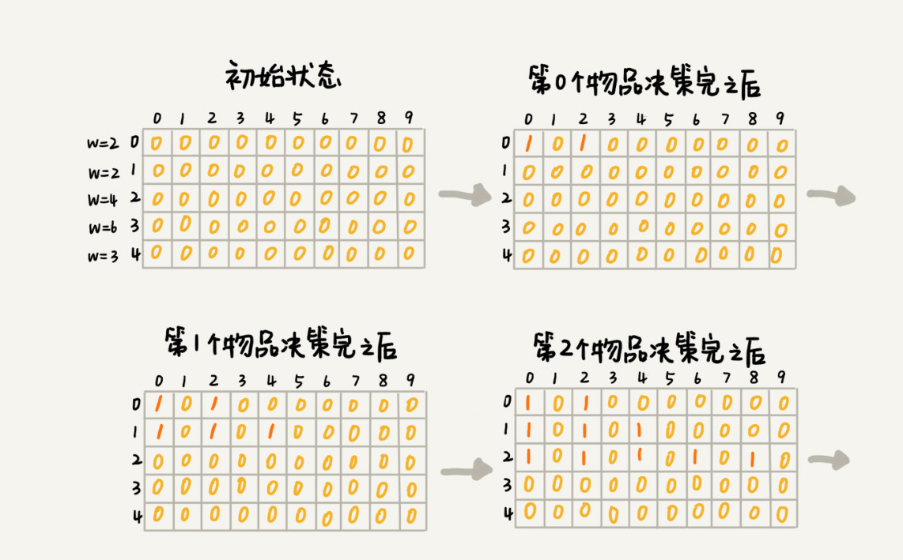

# 动态规划
>动态规划比较适合用来求解最优问题，比如求最大值、最小值等等。它可以非常显著地降低时间复杂度，提高代码的执行效率。

把问题分解为多个阶段，每个阶段对应一个决策。记录每一个阶段可达的状态集合（去掉重复的），然后通过当前阶段的状态集合，来推导下一个阶段的状态集合，动态地往前推进。这也是动态规划这个名字的由来。
大部分动态规划能解决的问题，都可以通过回溯算法来解决，只不过回溯算法解决起来效率比较低，时间复杂度是指数级的。动态规划算法，在执行效率方面，要高很多。尽管执行效率提高了，但是动态规划的空间复杂度也提高了，所以，很多时候，我们会说，动态规划是一种空间换时间的算法思想。

## 0-1 背包问题
对于一组不同重量、不可分割的物品，我们需要选择一些装入背包，在满足背包最大重量限制的前提下，背包中物品总重量的最大值是多少呢？

### 这个问题可以用回溯来解决，即是穷举所有可能的解法。
不过，回溯算法的复杂度比较高，是指数级别的。

假设背包的最大承载重量是 9。我们有 5 个不同的物品，每个物品的重量分别是 2，2，4，6，3。如果把这个例子的回溯求解过程，用递归树画出来，就是下面这个样子：

递归树中的每个节点表示一种状态，我们用（i, cw）来表示。其中，i 表示将要决策第几个物品是否装入背包，cw 表示当前背包中物品的总重量。比如，（2，2）表示我们将要决策第 2 个物品是否装入背包，在决策前，背包中物品的总重量是 2。从递归树中，你应该能会发现，有些子问题的求解是重复的，比如图中 f(2, 2) 和 f(3,4) 都被重复计算了两次。可以记录已经计算好的 f(i, cw)，当再次计算到重复的 f(i, cw) 的时候，可以直接从缓存中取出来用，就不用再递归计算了，这样就可以避免冗余计算。

### 动态规划

把整个求解过程分为 n 个阶段，每个阶段会决策一个物品是否放到背包中。每个物品决策（放入或者不放入背包）完之后，背包中的物品的重量会有多种情况，也就是说，会达到多种不同的状态，对应到递归树中，就是有很多不同的节点。
把每一层重复的状态（节点）合并，只记录不同的状态，然后基于上一层的状态集合，来推导下一层的状态集合。
可以通过合并每一层重复的状态，这样就保证每一层不同状态的个数都不会超过 w（w 表示背包的承载重量），也就是例子中的 9，就成功避免了每层状态个数的指数级增长。

- 用一个二维数组 states[n][w+1]，来记录每层可以达到的不同状态。
- 第 0 个（下标从 0 开始编号）物品的重量是 2，要么装入背包，要么不装入背包，决策完之后，会对应背包的两种状态，背包中物品的总重量是 0 或者 2。用 states[0][0]=true 和 states[0][2]=true 来表示这两种状态。
- 第 1 个物品的重量也是 2，基于之前的背包状态，在这个物品决策完之后，不同的状态有 3 个，背包中物品总重量分别是 0(0+0)，2(0+2 or 2+0)，4(2+2)。用 states[1][0]=true，states[1][2]=true，states[1][4]=true 来表示这三种状态。
- 以此类推，直到考察完所有的物品后，整个 states 状态数组就都计算好了。如图，图中 0 表示 false，1 表示 true。只需要在最后一层，找一个值为 true 的最接近 w（这里是 9）的值，就是背包中物品总重量的最大值。



```java
//weight:物品重量，n:物品个数，w:背包可承载重量
public int knapsack(int[] weight, int n, int w) {
  boolean[][] states = new boolean[n][w+1]; // 默认值false
  states[0][0] = true;  // 第一行的数据要特殊处理，可以利用哨兵优化
  if (weight[0] <= w) {
    states[0][weight[0]] = true;
  }
  for (int i = 1; i < n; ++i) { // 动态规划状态转移
    for (int j = 0; j <= w; ++j) {// 不把第i个物品放入背包
      if (states[i-1][j] == true) states[i][j] = states[i-1][j];
    }
    for (int j = 0; j <= w-weight[i]; ++j) {//把第i个物品放入背包
      if (states[i-1][j]==true) states[i][j+weight[i]] = true;
    }
  }
  for (int i = w; i >= 0; --i) { // 输出结果
    if (states[n-1][i] == true) return i;
  }
  return 0;
}
```

#### 复杂度分析
用回溯算法解决这个问题的时间复杂度 O(2^n)，是指数级的。
动态规划解决方案代码的时间复杂度非常好分析，耗时最多的部分就是代码中的两层 for 循环，所以时间复杂度是 O(n*w)。n 表示物品个数，w 表示背包可以承载的总重量。

由于需要额外申请一个 n 乘以 w+1 的二维数组，对空间的消耗比较多，空间复杂度为O(n * w)

### 空间优化
只需要关心上图中的最后一行
```java

public static int knapsack2(int[] items, int n, int w) {
  boolean[] states = new boolean[w+1]; // 默认值false
  states[0] = true;  // 第一行的数据要特殊处理，可以利用哨兵优化
  if (items[0] <= w) {
    states[items[0]] = true;
  }
  for (int i = 1; i < n; ++i) { // 动态规划
    for (int j = w-items[i]; j >= 0; --j) {//把第i个物品放入背包
      if (states[j]==true) states[j+items[i]] = true;
    }
  }
  for (int i = w; i >= 0; --i) { // 输出结果
    if (states[i] == true) return i;
  }
  return 0;
}
```
**特别强调一下代码中的第 8 行，j 需要从大到小来处理。如果按照 j 从小到大处理的话，会出现 for 循环重复计算的问题**
因为每个阶段处理后的状态转移方向是由低到高，如果在阶段内处理时也按从低到高遍历，那么就会出现原本该下一阶段处理的状态错误的前移到本阶段
从小到大处理时，会出现第i个物品放入背包前，states[j]本来应该是false，却因为它的上一个j - items[i]为true，导致states[j + items[i]]也被错误置为true。 例如一开始只有states[0]为true，然后items[i]为2，此时正常情况下应该是只有states[2]为置为true（从大到小处理），但是从小到大处理时，states[2]，states[4]，states[6]，states[8]都会被置为true


