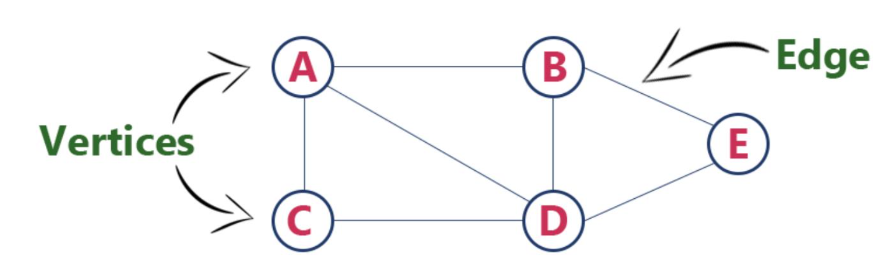
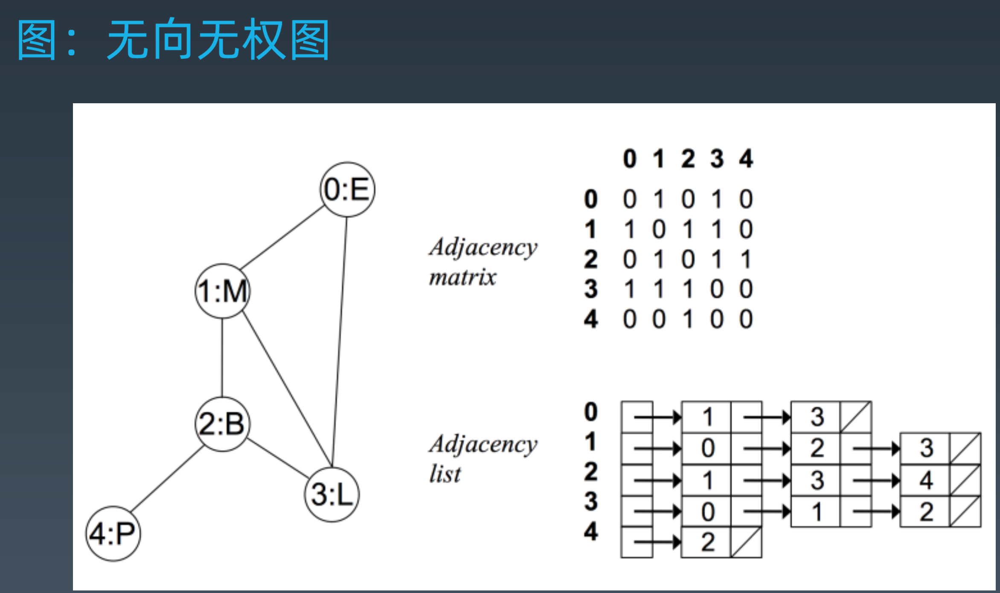
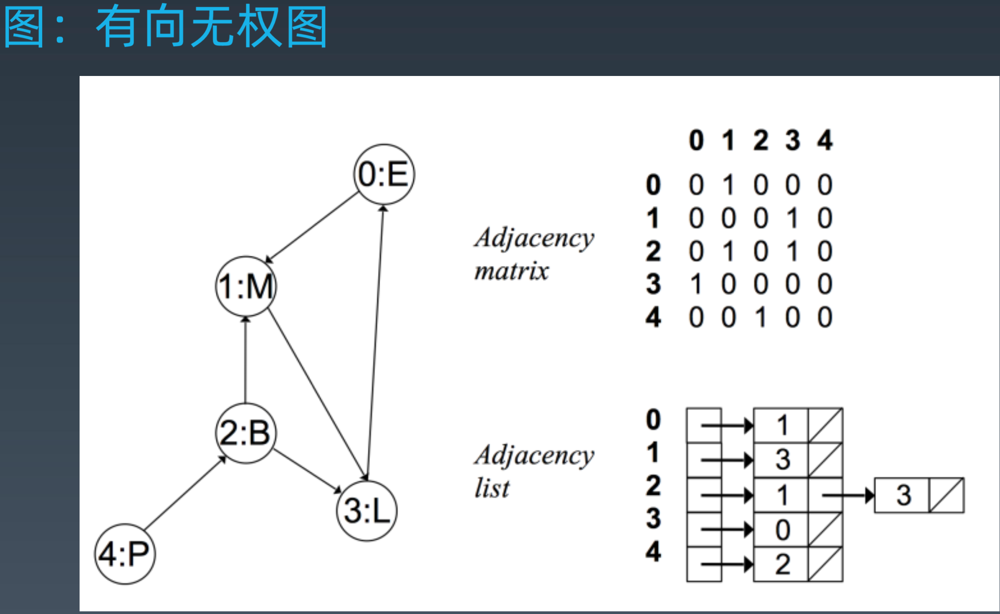
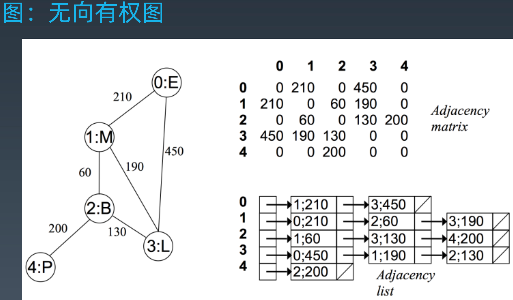

# 图
图（Graph）。和树比起来，这是一种更加复杂的非线性表结构。
树中的元素我们称为节点，图中的元素我们就叫做顶点（vertex）。从图中可以看出来，图中的一个顶点可以与任意其他顶点建立连接关系。我们把这种建立的关系叫做边（edge）。顶点的度（degree），就是跟顶点相连接的边的条数。

边有方向的图叫做“有向图”。边没有方向的图就叫做“无向图”。
无向图中有“度”这个概念，表示一个顶点有多少条边。在有向图中，把度分为入度（In-degree）和出度（Out-degree）。
顶点的入度，表示有多少条边指向这个顶点；顶点的出度，表示有多少条边是以这个顶点为起点指向其他顶点。
带权图（weighted graph）。在带权图中，每条边都有一个权重（weight），可以通过这个权重来表示 QQ 好友间的亲密度。

## 图的存储
- 邻接矩阵
- 邻接表

### 邻接矩阵
邻接矩阵的底层依赖一个二维数组。对于无向图来说，如果顶点 i 与顶点 j 之间有边，我们就将 A[i][j]和 A[j][i]标记为 1；对于有向图来说，如果顶点 i 到顶点 j 之间，有一条箭头从顶点 i 指向顶点 j 的边，那我们就将 A[i][j]标记为 1。同理，如果有一条箭头从顶点 j 指向顶点 i 的边，我们就将 A[j][i]标记为 1。对于带权图，数组中就存储相应的权重。

#### 缺点
- 对于无向图来说，如果 A[i][j]等于 1，那 A[j][i]也肯定等于 1。实际上，我们只需要存储一个就可以了。也就是说，无向图的二维数组中，如果我们将其用对角线划分为上下两部分，那我们只需要利用上面或者下面这样一半的空间就足够了，另外一半白白浪费掉了。
- 如果我们存储的是稀疏图（Sparse Matrix），也就是说，顶点很多，但每个顶点的边并不多，那邻接矩阵的存储方法就更加浪费空间了。比如微信有好几亿的用户，对应到图上就是好几亿的顶点。但是每个用户的好友并不会很多，一般也就三五百个而已。如果我们用邻接矩阵来存储，那绝大部分的存储空间都被浪费了。

#### 优点
- 存储方式简单、直接，因为基于数组，所以在获取两个顶点的关系时，就非常高效
- 方便计算。这是因为，用邻接矩阵的方式存储图，可以将很多图的运算转换成矩阵之间的运算。比如求解最短路径问题时会提到一个Floyd-Warshall 算法，就是利用矩阵循环相乘若干次得到结果。

### 邻接表
每个顶点对应一条链表（跳表、散列表或者红黑树等更优），链表中存储的是与这个顶点相连接的其他顶点。
如图，图中画的是一个有向图的邻接表存储方式，每个顶点对应的链表里面，存储的是指向的顶点。

#### 优缺点与邻接矩阵法相反

## 应用
### 如何存储微博等社交网络中的好友关系？

假设需要支持下面这样几个操作：
- 判断用户 A 是否关注了用户 
- B；判断用户 A 是否是用户 B 的粉丝；
- 用户 A 关注用户 B；
- 用户 A 取消关注用户 B；
- 根据用户名称的首字母排序，分页获取用户的粉丝列表；
- 根据用户名称的首字母排序，分页获取用户的关注列表。

#### 如何存储
- 因为社交网络是一张稀疏图，使用邻接矩阵存储比较浪费存储空间，所以用邻接表来存储。
- 还需要一个逆邻接表。邻接表中存储了用户的关注关系，逆邻接表中存储的是用户的被关注关系。对应到图上，邻接表中，每个顶点的链表中，存储的就是这个顶点指向的顶点，逆邻接表中，每个顶点的链表中，存储的是指向这个顶点的顶点。如果要查找某个用户关注了哪些用户，可以在邻接表中查找；如果要查找某个用户被哪些用户关注了，我们从逆邻接表中查找。

#### 优化
- 将链表换成跳表，因为跳表插入、删除、查找都非常高效，时间复杂度是 O(logn)，空间复杂度上稍高，是 O(n)。最重要的一点，跳表中存储的数据本来就是有序的了，分页获取粉丝列表或关注列表，就非常高效。
- 数据量很大时，可以通过哈希算法等数据分片方式，将邻接表存储在不同的机器上。逆邻接表的处理方式也一样。当要查询顶点与顶点关系的时候，就利用同样的哈希算法，先定位顶点所在的机器，然后再在相应的机器上查找。

### 除了社交网络可以用图来表示之外，符合图这种结构特点的例子还有很多
比如知识图谱（Knowledge Graph）、地图、网络、Gradle这个编译工具，内部组织task的方式用的是有向图、Android framework层提供了一个CoordinatorLayout，其内部协调子view的联动，也是用的图
生活工作中应用图的例子。很多，互联网上网页之间通过超链接连接成一张有向图；城市乃至全国交通网络是一张加权图；人与人之间的人际关系够成一张图，著名的六度分割理论据说就是基于这个得到的。

### 如何选择
1. 内存中用临界表
2. 要持久化存储就用数据库
3. 超大图 并且涉及大量图计算。用专业的图数据库

