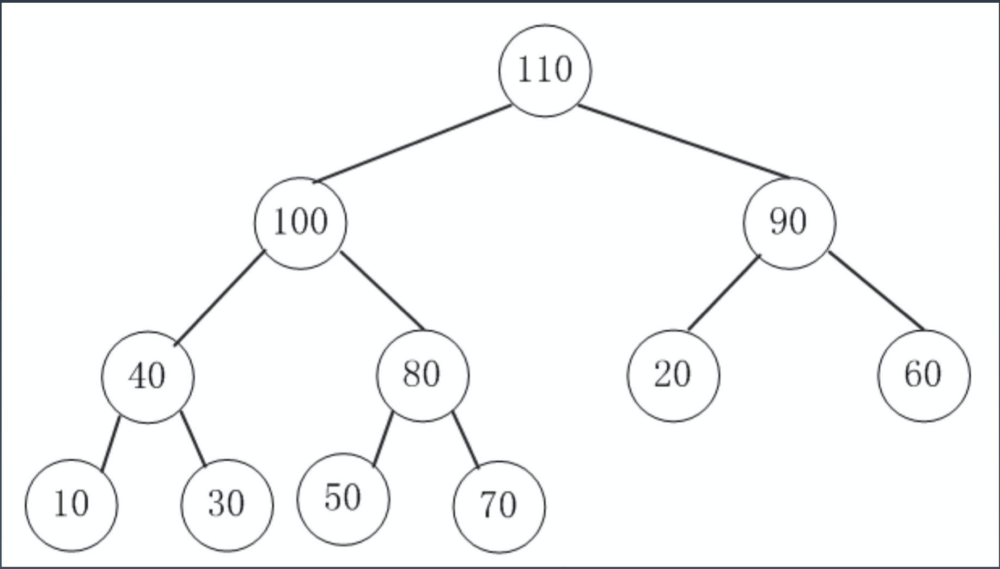
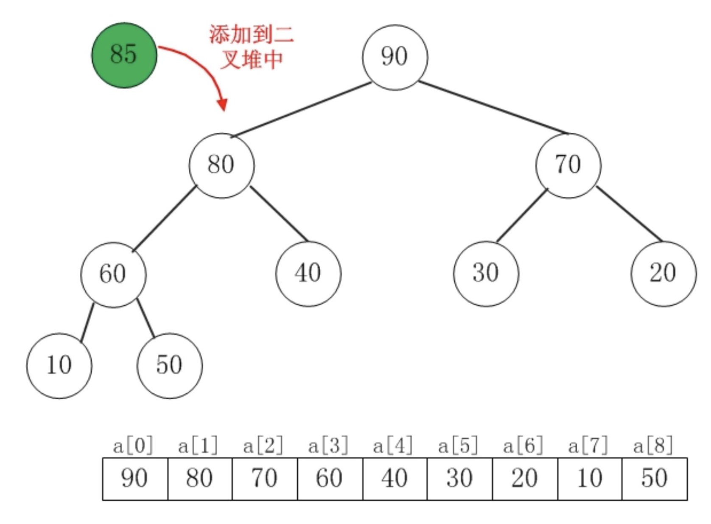
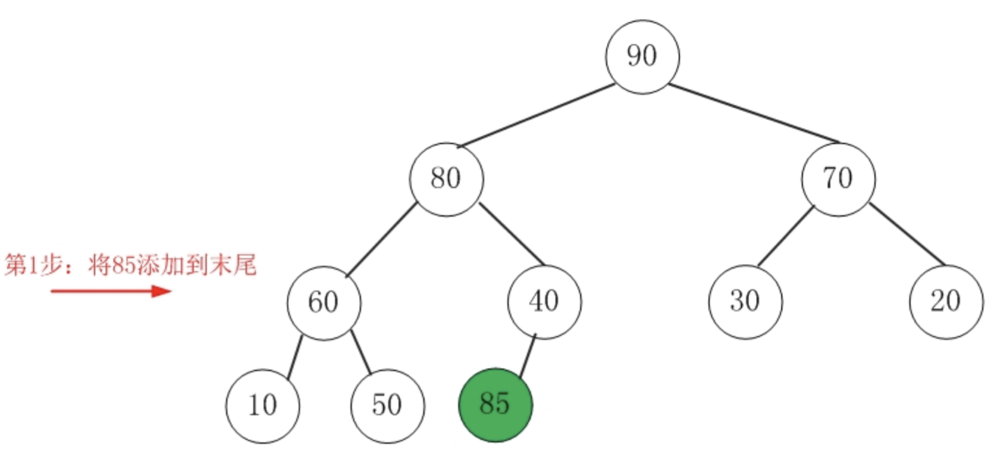
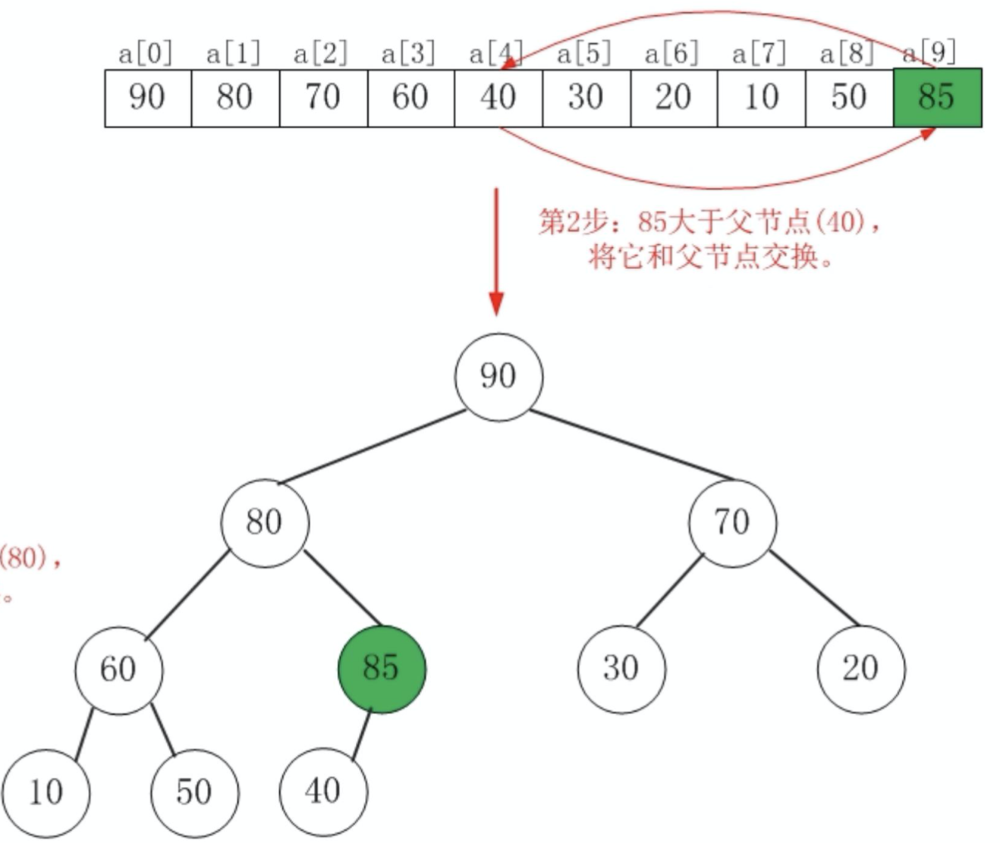
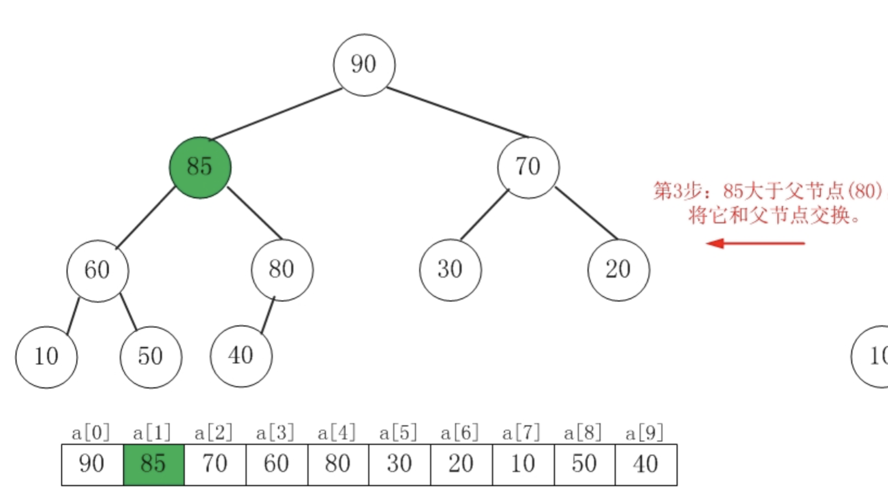
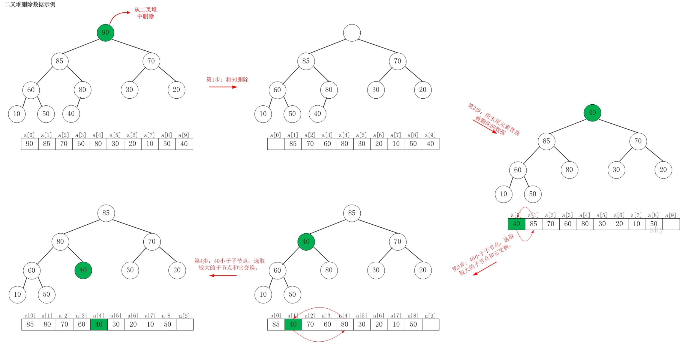

# 堆 Heap
heap：可以迅速找到一堆数中的最大或者最小值的数据结构
根节点最大的叫做大顶堆或者大根堆，根节点最小的叫做小顶堆或者小根堆
常见的堆有二叉堆、斐波拉契堆等

## 堆的比较
常见的api操作有：
- find-max(min) :       O(1)
- delete-max(min) :     O(log n)
- insert(create) : O(log n)

堆的不同实现比较https://en.wikipedia.org/wiki/Heap_(data_structure)

## 二叉堆
通过完全二叉树来实现（不是二叉搜索树）
二叉堆（大顶堆）满足：
- 是一颗完全树
- 树中任意节点的值总是 >= 其子节点的值

### 二叉堆实现
- 一般通过数组实现
- 假设第一个元素在数组中的索引为0的话，则父节点和子节点的位置关系如下：
    - 根节点元素为a[0]
    - 索引为 i 的左孩子的索引为 2*i + 1；
    - 索引为 i 的右孩子的索引为 2*i + 2；
    - 索引为 i 的父节点的索引为 floor((i-1)/2)

### 插入操作 O(log n)
- 新元素一律插到堆的尾部
- 依次向上调整整个堆的结构，一直到根

### 删除操作  O(log n)
- 将堆尾元素替换到顶部
- 依次从根部向下调整整个堆的结构

**注：二叉堆是优先队列的一种常见且简单的实现，但不是最佳实现**

# 堆的应用
## 一、优先队列
### 1. 合并有序小文件

假设有 100 个小文件，每个文件的大小是 100MB，每个文件中存储的都是有序的字符串。希望将这些 100 个小文件合并成一个有序的大文件。

**只用数组实现的情况**
从这 100 个文件中，各取第一个字符串，放入数组中，然后比较大小，把最小的那个字符串放入合并后的大文件中，并从数组中删除。
假设，这个最小的字符串来自于 13.txt 这个小文件，就再从这个小文件取下一个字符串，放到数组中，重新比较大小，并且选择最小的放入合并后的大文件，将它从数组中删除。依次类推，直到所有的文件中的数据都放入到大文件为止。
用数组这种数据结构，来存储从小文件中取出来的字符串。每次从数组中取最小字符串，都需要循环遍历整个数组，显然，这不是很高效。
**用优先队列，也就是说堆**
将从小文件中取出来的字符串放入到小顶堆中，那堆顶的元素，也就是优先级队列队首的元素，就是最小的字符串。
将这个字符串放入到大文件中，并将其从堆中删除。然后再从小文件中取出下一个字符串，放入到堆中。循环这个过程，就可以将 100 个小文件中的数据依次放入到大文件中。

删除堆顶数据和往堆中插入数据的时间复杂度都是 O(logn)，n 表示堆中的数据个数，这里就是 100。

### 2. 高性能定时器

假设有一个定时器，定时器中维护了很多定时任务，每个任务都设定了一个要触发执行的时间点。定时器每过一个很小的单位时间（比如 1 秒），就扫描一遍任务，看是否有任务到达设定的执行时间。如果到达了，就拿出来执行。
这个定时器有两点低效：
- 第一，任务的约定执行时间离当前时间可能还有很久，这样前面很多次扫描其实都是徒劳的；
- 第二，每次都要扫描整个任务列表，如果任务列表很大的话，势必会比较耗时。

**用优先队列**
按照任务设定的执行时间，将这些任务存储在优先级队列中，队列首部（也就是小顶堆的堆顶）存储的是最先执行的任务。
这样，定时器就不需要每隔 1 秒就扫描一遍任务列表了。它拿队首任务的执行时间点，与当前时间点相减，得到一个时间间隔 T。
这个时间间隔 T 就是，从当前时间开始，需要等待多久，才会有第一个任务需要被执行。这样，定时器就可以设定在 T 秒之后，再来执行任务。
从当前时间点到（T-1）秒这段时间里，定时器都不需要做任何事情。当 T 秒时间过去之后，定时器取优先级队列中队首的任务执行。然后再计算新的队首任务的执行时间点与当前时间点的差值，把这个值作为定时器执行下一个任务需要等待的时间。

## 二、利用堆求 Top K
#### 针对静态数据，如何在一个包含 n 个数据的数组中，查找前 K 大数据呢（n>k）？
可以维护一个大小为 K 的小顶堆，顺序遍历数组，先把k个元素插入堆中，从数组中取出数据与堆顶元素比较。
- 如果比堆顶元素大，就把堆顶元素删除，并且将这个元素插入到堆中；
- 如果比堆顶元素小，则不做处理，继续遍历数组。这样等数组中的数据都遍历完之后，堆中的数据就是前 K 大数据了。

遍历数组需要 O(n) 的时间复杂度，一次堆化操作需要 O(logK) 的时间复杂度，所以最坏情况下，n 个元素都入堆一次，时间复杂度就是 O(nlogK)。

#### 针对动态数据求得 Top K 就是实时 Top K。
一个数据集合中有两个操作，一个是添加数据，另一个询问当前的前 K 大数据。如果每次询问前 K 大数据，都基于当前的数据重新计算的话，那时间复杂度就是 O(nlogK)，n 表示当前的数据的大小。
实际上，可以一直都维护一个 K 大小的小顶堆，先把k个元素插入堆中，当有数据被添加到集合中时，就拿它与堆顶的元素对比。
- 如果比堆顶元素大，就把堆顶元素删除，并且将这个元素插入到堆中；
- 如果比堆顶元素小，则不做处理。
这样，无论任何时候需要查询当前的前 K 大数据，都可以立刻返回。

例如包含 10 亿个搜索关键词的日志文件，如何快速获取到 Top 10 最热门的搜索关键词呢？处理的场景限定为单机，可以使用的内存为 1GB。
- 首先，顺序扫描这 10 亿个搜索关键词。当扫描到某个关键词时，去散列表中查询。
- 如果存在，我们就将对应的次数加一；
- 如果不存在，我们就将它插入到散列表，并记录次数为 1。
- 以此类推，等遍历完这 10 亿个搜索关键词之后，散列表中就存储了不重复的搜索关键词以及出现的次数。

再根据前面讲的用堆求 Top K 的方法，建立一个大小为 10 的小顶堆，遍历散列表，依次取出每个搜索关键词及对应出现的次数，然后与堆顶的搜索关键词对比。如果出现次数比堆顶搜索关键词的次数多，那就删除堆顶的关键词，将这个出现次数更多的关键词加入到堆中。以此类推，当遍历完整个散列表中的搜索关键词之后，堆中的搜索关键词就是出现次数最多的 Top 10 搜索关键词了。

**但是，限定在单机且内存1G的情况下**，hash表是存不下10亿数据的，因为假设 10 亿条搜索关键词中不重复的有 1 亿条，如果每个搜索关键词的平均长度是 50 个字节，那存储 1 亿个关键词起码需要 5GB 的内存空间，而散列表因为要避免频繁冲突，不会选择太大的装载因子，所以消耗的内存空间就更多了。
**解决办法：**
相同数据经过哈希算法得到的哈希值是一样的。可以根据哈希算法的这个特点，将 10 亿条搜索关键词先通过哈希算法分片到 10 个文件中。
- 遍历这 10 亿个关键词的同时，通过某个哈希算法对其求哈希值，然后哈希值同 10 取模，得到的结果就是这个搜索关键词应该被分到的文件编号。
- 对这 10 亿个关键词分片之后，每个文件都只有 1 亿的关键词，去除掉重复的，可能就只有 1000 万个，每个关键词平均 50 个字节，所以总的大小就是 500MB。1GB 的内存完全可以放得下。
- 针对每个包含 1 亿条搜索关键词的文件，利用散列表和堆，分别求出 Top 10，然后把这个 10 个 Top 10 放在一块，然后取这 100 个关键词中，出现次数最多的 10 个关键词，这就是这 10 亿数据中的 Top 10 最频繁的搜索关键词了。

## 三、利用堆求动态数据的中位数
维护两个堆，一个大顶堆，一个小顶堆。大顶堆中存储前半部分数据，小顶堆中存储后半部分数据，且小顶堆中的数据都大于大顶堆中的数据。

- 如果新加入的数据大于等于小顶堆的堆顶元素，就将这个新数据插入到小顶堆；
- 否则，就将这个新数据插入到大顶堆。

这个时候就有可能出现，两个堆中的数据个数不符合前面约定的情况：如果 n 是偶数，两个堆中的数据个数都是 n/2​；如果 n 是奇数，大顶堆有 n/2​+1 个数据，小顶堆有 n/1 个数据。这个时候，可以从一个堆中不停地将堆顶元素移动到另一个堆，通过这样的调整，来让两个堆中的数据满足上面的约定。

插入数据因为需要涉及堆化，所以时间复杂度变成了 O(logn)，但是求中位数只需要返回大顶堆的堆顶元素就可以了，所以时间复杂度就是 O(1)。

