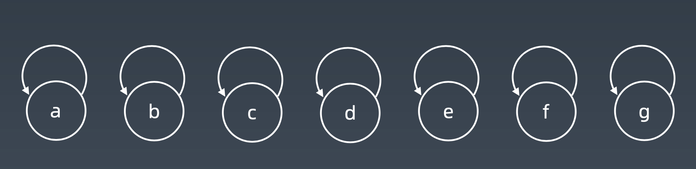
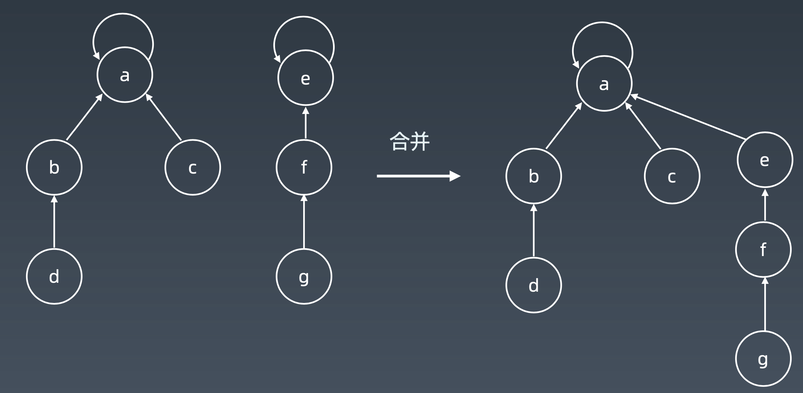
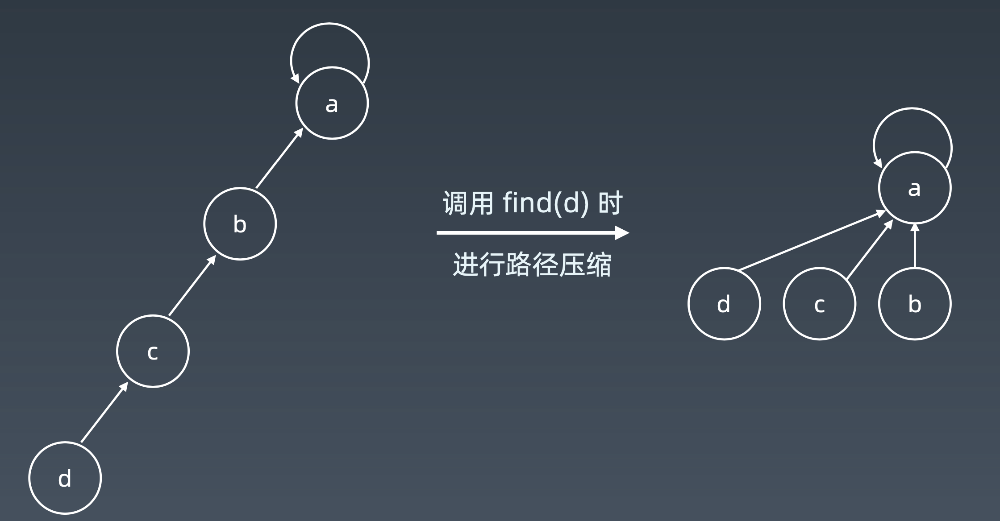

# 并查集 Disjoint Set
并查集是一种树型的数据结构，用于处理一些不交集（Disjoint Sets）的合并及查询问题。有一个联合-查找算法（Union-find Algorithm）定义了两个用于此数据结构的操作：
- Find：确定元素属于哪一个子集。它可以被用来确定两个元素是否属于同一子集。
- Union：将两个子集合并成同一个集合。

由于支持这两种操作，一个不相交集也常被称为联合-查找数据结构（union-find data structure）或合并-查找集合（merge-find set）。其他的重要方法，MakeSet，用于创建单元素集合。
为了更加精确的定义这些方法，需要定义如何表示集合。一种常用的策略是为每个集合选定一个固定的元素，称为代表，以表示整个集合。接着，Find(x) 返回x所属集合的代表，而Union使用两个集合的代表作为参数。

## 适用场景
- 组团、配对问题
- 判断两两是否属于同一个组

## 基本操作
- makeSet(s): 建立一个新的并查集，其中包含 s 个单元素集合。
- unionSet(x, y): 把元素 x 和元素 y 所在的集合合并，要求 x 和 y 所在的集合不相交，如果相交则不合并。
- find(x): 找到元素 x 所在的集合的代表，该操作也可以用于判断两个元 素是否位于同一个集合，只要将它们各自的代表比较一下就可以了。

### 初始化
每个元素都属于各自元素组成的集合，集合代表也为自身


### 查询、合并


### 路径压缩



## 代码实现
### java
```java
class UnionFind {
    private int count = 0;
    private int[] parent;

    public UnionFind(int n) {
        count = n;
        parent = new int[n];
        for (int i = 0; i < n; i++) {
            parent[i] = i;
        }
    }
    public int find(int p) {
        while (p != parent[p]) {
            parent[p] = parent[parent[p]];
            p = parent[p];
        }
        return p;
    }
    public void union(int p, int q) {
        int rootP = find(p);
        int rootQ = find(q);

        if (rootP == rootQ) {
            return;
        }
        parent[rootP] = rootQ;
        count--;
    }
}

```

### python
```python
class UnionFind:
    def init(p):
    # for i = 0 .. n: p[i] = i; 
        p = [i for i in range(n)]
    def union(self, p, i, j): 
        p1 = self.parent(p, i) 
        p2 = self.parent(p, j) 
        p[p1] = p2
    def parent(self, p, i):
        root = i
        while p[root] != root:
            root = p[root]
        while p[i] != i: # 路径压缩 ?
        x = i; i = p[i]; p[x] = root
        return root
```


