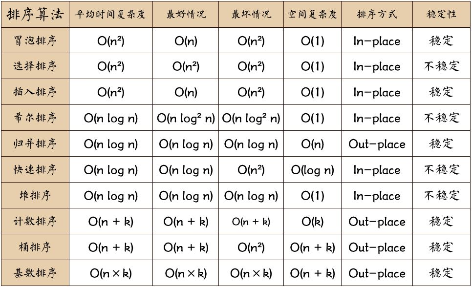

# 排序
最经典的、最常用的排序算法：冒泡排序、插入排序、选择排序、归并排序、快速排序、计数排序、基数排序、桶排序。



基于比较的排序算法的执行过程，会涉及两种操作，一种是元素比较大小，另一种是元素交换或移动。

## 相关理论
### 排序算法的执行效率衡量
1. 最好情况、最坏情况、平均情况时间复杂度
2. 时间复杂度的系数、常数 、低阶，在对同一阶时间复杂度的排序算法性能对比的时候，如果数据量较少，就要把系数、常数、低阶也考虑进来。
3. 比较次数和交换（或移动）次数

### 排序算法的内存消耗
算法的内存消耗可以通过空间复杂度来衡量，排序算法也不例外。不过，针对排序算法的空间复杂度，我们还引入了一个新的概念，原地排序（Sorted in place）。原地排序算法，就是特指空间复杂度是 O(1) 的排序算法，也就是除了存储数据本身的空间不需要额外的辅助存储空间。

### 排序算法的稳定性
针对排序算法，还有一个重要的度量指标，稳定性。
稳定性是指，如果待排序的序列中存在值相等的元素，经过排序之后，相等元素之间原有的先后顺序不变。
比如我们有一组数据 2，9，3，4，8，3，按照大小排序之后就是 2，3，3，4，8，9。这组数据里有两个 3。经过某种排序算法排序之后，如果两个 3 的前后顺序没有改变，那我们就把这种排序算法叫作稳定的排序算法；如果前后顺序发生变化，那对应的排序算法就叫作不稳定的排序算法。

### “有序度”和“逆序度”
**有序度**是数组中具有有序关系的元素对的个数。

同理，对于一个倒序排列的数组，比如 6，5，4，3，2，1，有序度是 0；对于一个完全有序的数组，比如 1，2，3，4，5，6，有序度就是 n*(n-1)/2，也就是 15。我们把这种完全有序的数组的有序度叫作**满有序度**。

**逆序度** 的定义正好跟有序度相反（默认从小到大为有序），是数组中具有逆序关系的元素对的个数。
**逆序度 = 满有序度 - 有序度**。我们排序的过程就是一种增加有序度，减少逆序度的过程，最后达到满有序度，就说明排序完成了。
例如：要排序的数组的初始状态是 4，5，6，3，2，1 ，其中，有序元素对有 (4，5) (4，6)(5，6)，所以有序度是 3。n=6，所以冒泡排序完成之后终态的满有序度为 n*(n-1)/2=15。

## 冒泡排序（Bubble Sort）
冒泡排序**只会操作相邻的两个数据**。每次冒泡操作都会对相邻的两个元素进行比较，看是否满足大小关系要求。如果不满足就让它俩互换。一次冒泡会让至少一个元素移动到它应该在的位置，重复 n 次，就完成了 n 个数据的排序工作。

要对一组数据 4，5，6，3，2，1，从小到大进行排序。第一次冒泡操作的详细过程就是这样：


可以看出，经过一次冒泡操作之后，6 这个元素已经存储在正确的位置上。要想完成所有数据的排序，我们只要进行 6 次这样的冒泡操作就行了。


### 冒泡排序优化
当某次冒泡操作已经没有数据交换时，说明已经达到完全有序，不用再继续执行后续的冒泡操作。
如图，这里面给 6 个元素排序，只需要 4 次冒泡操作就可以了。


### 代码实现
```java

// 冒泡排序，a表示数组，n表示数组大小
public void bubbleSort(int[] a, int n) {
  if (n <= 1) return;
 
  for (int i = 0; i < n; ++i) {
    // 提前退出冒泡循环的标志位
    boolean flag = false;
    for (int j = 0; j < n - i - 1; ++j) {
      if (a[j] > a[j+1]) { // 交换
        int tmp = a[j];
        a[j] = a[j+1];
        a[j+1] = tmp;
        flag = true;  // 表示有数据交换      
      }
    }
    if (!flag) break;  // 没有数据交换，提前退出
  }
}
```

### 特点
- 是原地排序算法：冒泡的过程只涉及相邻数据的交换操作，只需要常量级的临时空间，所以它的空间复杂度为 O(1)，是一个原地排序算法。
- 是稳定的排序算法：在冒泡排序中，只有交换才可以改变两个元素的前后顺序。为了保证冒泡排序算法的稳定性，当有相邻的两个元素大小相等的时候，不做交换，相同大小的数据在排序前后不会改变顺序

### 时间复杂度分析
- 最好情况时间复杂度：
最好情况下，要排序的数据已经是有序的了，我们只需要进行一次冒泡操作，就可以结束了，所以最好情况时间复杂度是 O(n)。
- 最坏情况时间复杂度：
而最坏的情况是，要排序的数据刚好是倒序排列的，我们需要进行 n 次冒泡操作，所以最坏情况时间复杂度为 O(n^2)。
- 平均情况时间复杂度
冒泡排序包含两个操作原子，比较和交换。每交换一次，有序度就加 1。不管算法怎么改进，交换次数总是确定的，即为逆序度，也就是n*(n-1)/2–初始有序度。对于包含 n 个数据的数组进行冒泡排序，最坏情况下，初始状态的有序度是 0，所以要进行 n*(n-1)/2 次交换。最好情况下，初始状态的有序度是 n*(n-1)/2，就不需要进行交换。我们可以取个中间值 n*(n-1)/4，来表示初始有序度既不是很高也不是很低的平均情况。换句话说，平均情况下，需要 n*(n-1)/4 次交换操作，比较操作肯定要比交换操作多，而复杂度的上限是 O(n^2)，所以平均情况下的时间复杂度就是 O(n^2)。

## 插入排序（Insertion Sort）
插入排序是通过数组动态排序的过程，即动态地往有序集合中添加数据且保持数组有序的思想实现排序的。

- 首先将数组中的数据分为两个区间，已排序区间和未排序区间。
- 初始已排序区间只有一个元素，就是数组的第一个元素。
- 插入算法的核心思想是取未排序区间中的元素，在已排序区间中找到合适的插入位置将其插入，并保证已排序区间数据一直有序。
- 重复这个过程，直到未排序区间中元素为空，算法结束。

插入排序也包含两种操作，一种是元素的比较，一种是元素的移动。当我们需要将一个数据 a 插入到已排序区间时，需要拿 a 与已排序区间的元素依次比较大小，找到合适的插入位置。找到插入点之后，我们还需要将插入点之后的元素顺序往后移动一位，这样才能腾出位置给元素 a 插入。
如图所示，要排序的数据是 4，5，6，1，3，2，其中左侧为已排序区间，右侧是未排序区间。


对于不同的查找插入点方法（从头到尾、从尾到头），元素的比较次数是有区别的。**但对于一个给定的初始序列，移动操作的次数总是固定的，就等于逆序度。** 如图中例子，满有序度是 n*(n-1)/2=15，初始序列的有序度是 5，所以逆序度是 10。插入排序中，数据移动的个数总和也等于 10=3+3+4。


### 代码实现
```java

// 插入排序，a表示数组，n表示数组大小
public void insertionSort(int[] a, int n) {
  if (n <= 1) return;

  for (int i = 1; i < n; ++i) {
    int value = a[i];
    int j = i - 1;
    // 查找插入的位置
    for (; j >= 0; --j) {
      if (a[j] > value) {
        a[j+1] = a[j];  // 数据移动
      } else {
        break;
      }
    }
    a[j+1] = value; // 插入数据
  }
}
public static int[] insertionSort(int[] array) {
    if (array.length == 0)
        return array;
    int current;
    for (int i = 0; i < array.length - 1; i++) {
        current = array[i + 1];
        int preIndex = i;
        while (preIndex >= 0 && current < array[preIndex]) {
            array[preIndex + 1] = array[preIndex];
            preIndex--;
        }
        array[preIndex + 1] = current;
    }
    return array;
}
```
### 特点
- 是原地排序算法：不需要额外的存储空间，所以空间复杂度是 O(1)，也就是说，这是一个原地排序算法。
- 是稳定排序算法：在插入排序中，对于值相同的元素，我们可以选择将后面出现的元素，插入到前面出现元素的后面，这样就可以保持原有的前后顺序不变

### 时间复杂度
- 最好情况时间复杂度
如果要排序的数据已经是有序的，我们并不需要搬移任何数据。如果我们从尾到头在有序数据组里面查找插入位置，每次只需要比较一个数据就能确定插入的位置。所以这种情况下，最好是时间复杂度为 O(n)。
- 最坏情况时间复杂度
如果数组是倒序的，每次插入都相当于在数组的第一个位置插入新的数据，所以需要移动大量的数据，所以最坏情况时间复杂度为 O(n^2)。
- 平均情况时间复杂度
在数组中插入一个数据的平均时间复杂度是 O(n)。所以，对于插入排序来说，每次插入操作都相当于在数组中插入一个数据，循环执行 n 次插入操作，所以平均时间复杂度为 O(n^2)。

## 选择排序（Selection Sort）
选择排序算法的实现思路有点类似插入排序，也分已排序区间和未排序区间。但是选择排序每次会从未排序区间中找到最小的元素，将其放到已排序区间的末尾。


### 代码实现
```java
public static int[] selectionSort(int[] array) {
       if (array.length == 0)
           return array;
       for (int i = 0; i < array.length; i++) {
           int minIndex = i;
           for (int j = i; j < array.length; j++) {
               if (array[j] < array[minIndex]) //找到最小的数
                   minIndex = j; //将最小数的索引保存
           }
           int temp = array[minIndex];
           array[minIndex] = array[i];
           array[i] = temp;
       }
       return array;
   }
```
### 特点
- 是原地排序算法，空间复杂度为 O(1)
- 不是稳定排序算法，选择排序每次都要找剩余未排序元素中的最小值，并和前面的元素交换位置，这样破坏了稳定性。比如 5，8，5，2，9 这样一组数据，使用选择排序算法来排序的话，第一次找到最小元素 2，与第一个 5 交换位置，那第一个 5 和中间的 5 顺序就变了，所以就不稳定了。正是因此，相对于冒泡排序和插入排序，选择排序就稍微逊色了。

### 时间复杂度
选择排序的最好情况时间复杂度、最坏情况和平均情况时间复杂度都为 O(n^2)。

## 对比
为什么插入排序要比冒泡排序更受欢迎呢？
我们前面分析冒泡排序和插入排序的时候讲到，冒泡排序不管怎么优化，元素交换的次数是一个固定值，是原始数据的逆序度。插入排序是同样的，不管怎么优化，元素移动的次数也等于原始数据的逆序度。
但是，从代码实现上来看，冒泡排序的数据交换要比插入排序的数据移动要复杂，冒泡排序需要 3 个赋值操作，而插入排序只需要 1 个。
```java

//冒泡排序中数据的交换操作：
if (a[j] > a[j+1]) { // 交换
   int tmp = a[j];
   a[j] = a[j+1];
   a[j+1] = tmp;
   flag = true;
}

//插入排序中数据的移动操作：
if (a[j] > value) {
  a[j+1] = a[j];  // 数据移动
} else {
  break;
}
```
我们把执行一个赋值语句的时间粗略地计为单位时间（unit_time），然后分别用冒泡排序和插入排序对同一个逆序度是 K 的数组进行排序。用冒泡排序，需要 K 次交换操作，每次需要 3 个赋值语句，所以交换操作总耗时就是 3*K 单位时间。而插入排序中数据移动操作只需要 K 个单位时间。


