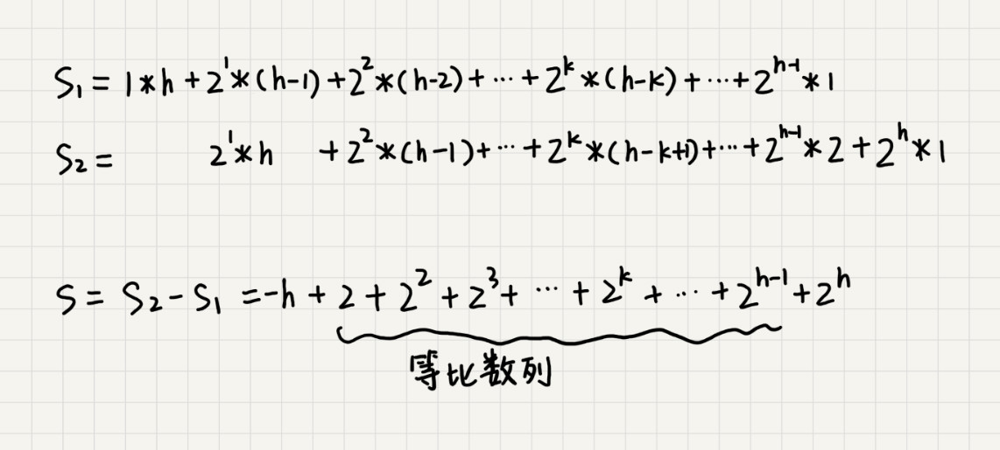

# 排序
这篇讲复杂度为 O(nlogn) 的排序算法，归并排序和快速排序。这两种排序算法都用到了分治思想，适合大规模的数据排序。最后补充复杂度同样为O(logn)的堆排序。

## 归并排序（Merge Sort）
先把数组从中间分成前后两部分，然后对前后两部分分别排序，再将排好序的两部分合并在一起，这样整个数组就都有序了。


归并排序利用了分治的思想，可以使用递归来实现
```shell
递推公式：
merge_sort(p…r) = merge(merge_sort(p…q), merge_sort(q+1…r))

终止条件：
p >= r 不用再继续分解
```
merge_sort(p…r) 表示，给下标从 p 到 r 之间的数组排序。我们将这个排序问题转化为了两个子问题，merge_sort(p…q) 和 merge_sort(q+1…r)，其中下标 q 等于 p 和 r 的中间位置，也就是 (p+r)/2。当下标从 p 到 q 和从 q+1 到 r 这两个子数组都排好序之后，我们再将两个有序的子数组合并在一起，这样下标从 p 到 r 之间的数据就也排好序了。
merge(A[p…r], A[p…q], A[q+1…r]) 这个函数的作用就是，将已经有序的 A[p…q]和 A[q+1…r]合并成一个有序的数组，并且放入 A[p…r]。
### 代码实现
```java
/**
    * 归并排序
    *
    * @param array
    * @return
    */
   public static int[] MergeSort(int[] array) {
       if (array.length < 2) return array;
       int mid = array.length / 2;
       int[] left = Arrays.copyOfRange(array, 0, mid);
       int[] right = Arrays.copyOfRange(array, mid, array.length);
       return merge(MergeSort(left), MergeSort(right));
   }
   /**
    * 归并排序——将两段排序好的数组结合成一个排序数组
    *
    * @param left
    * @param right
    * @return
    */
   public static int[] merge(int[] left, int[] right) {
       int[] result = new int[left.length + right.length];
       for (int index = 0, i = 0, j = 0; index < result.length; index++) {
           if (i >= left.length)
               result[index] = right[j++];
           else if (j >= right.length)
               result[index] = left[i++];
           else if (left[i] > right[j])
               result[index] = right[j++];
           else
               result[index] = left[i++];
       }
       return result;
   }
```
### 特点
- 不是原地排序算法：由上面实现可以看出，需要用到额外数组空间来存储，所以不是原地
- 是稳定排序算法：归并排序稳不稳定关键要看 merge() 函数，也就是两个有序子数组合并成一个有序数组的那部分代码。在合并的过程中，如果 A[p…q]和 A[q+1…r]之间有值相同的元素，那我们可以先把 A[p…q]中的元素放入 tmp 数组。这样就保证了值相同的元素，在合并前后的先后顺序不变。

### 时间复杂度分析
由上面分析和代码可以看出，merge()函数合并两个有序子数组的时间复杂度是 O(n)。
每递归一次，就需要调用一次merge函数，所以时间复杂度应该等于 递归次数 * O(merge())
而对于递归次数，由于每次都是取待排序数组的一半，类似于二分查找，当待排序数组长度<=1时到达递归终止条件，假设递归次数为k，那么n/(2^k) = 1，可以求得 k=log2n，
所以归并排序的时间复杂度为O(nlogn)
另外可以看出，归并排序的执行效率与要排序的原始数组的有序程度无关，所以其时间复杂度是非常稳定的，不管是最好情况、最坏情况，还是平均情况，时间复杂度都是 O(nlogn)。

### 空间复杂度分析
归并排序不是原地排序的，那需要申请的额外空间是多少？
递归代码的空间复杂度并不能像时间复杂度那样累加。尽管每次合并操作都需要申请额外的内存空间，但在合并完成之后，临时开辟的内存空间就被释放掉了。在任意时刻，CPU 只会有一个函数在执行，也就只会有一个临时的内存空间在使用。临时内存空间最大也不会超过 n 个数据的大小，所以空间复杂度是 O(n)。

## 快速排序（Quicksort）
快排，也用到了分治的思想，但是和归并排序不同。
如果要排序数组中下标从 p 到 r 之间的一组数据，我们选择 p 到 r 之间的任意一个数据作为 pivot（分区点）。
遍历 p 到 r 之间的数据，将小于 pivot 的放到左边，将大于 pivot 的放到右边，将 pivot 放到中间。
经过这一步骤之后，数组 p 到 r 之间的数据就被分成了三个部分，前面 p 到 q-1 之间都是小于 pivot 的，中间是 pivot，后面的 q+1 到 r 之间是大于 pivot 的。

根据分治、递归的处理思想，我们可以用递归排序下标从 p 到 q-1 之间的数据和下标从 q+1 到 r 之间的数据，直到区间缩小为 1，就说明所有的数据都有序了。
```shell
递推公式：
quick_sort(p…r) = quick_sort(p…q-1) + quick_sort(q+1… r)

终止条件：
p >= r
```
伪代码
```java

// 快速排序，A是数组，n表示数组的大小
quick_sort(A, n) {
  quick_sort_c(A, 0, n-1)
}
// 快速排序递归函数，p,r为下标
quick_sort_c(A, p, r) {
  if p >= r then return
  
  q = partition(A, p, r) // 获取分区点
  quick_sort_c(A, p, q-1)
  quick_sort_c(A, q+1, r)
}
```
partition() 分区函数就是随机选择一个元素作为 pivot（一般情况下，可以选择 p 到 r 区间的最后一个元素），然后对 A[p…r]分区，函数返回 pivot 的下标。
partition() 分区函数不能占用太多额外的内存空间，需要在 A[p…r]的原地完成分区操作，否则就会变成非原地排序算法了。
```java
partition(A, p, r) {
  pivot := A[r]
  i := p
  for j := p to r-1 do {
    if A[j] < pivot {
      swap A[i] with A[j]
      i := i+1
    }
  }
  swap A[i] with A[r]
  return i
}
```
这里的处理有点类似选择排序。我们通过游标 i 把 A[p…r-1]分成两部分。A[p…i-1]的元素都是小于 pivot 的，我们暂且叫它“已处理区间”，A[i…r-1]是“未处理区间”。我们每次都从未处理的区间 A[i…r-1]中取一个元素 A[j]，与 pivot 对比，如果小于 pivot，则将其加入到已处理区间的尾部，也就是 A[i]的位置。只需要将 A[i]与 A[j]交换，就可以在 O(1) 时间复杂度内将 A[j]放到下标为 i 的位置。


### 代码实现
```java
    public static int[] QuickSort(int[] array, int start, int end) {
       if (array.length < 1 || start < 0 || end >= array.length || start > end) return null;
       int smallIndex = partition(array, start, end);
       if (smallIndex > start)
           QuickSort(array, start, smallIndex - 1);
       if (smallIndex < end)
           QuickSort(array, smallIndex + 1, end);
       return array;
   }
   /**
    * 快速排序算法——partition
    * @param array
    * @param start
    * @param end
    * @return
    */
   public static int partition(int[] array, int start, int end) {
       int pivot = (int) (start + Math.random() * (end - start + 1));
       int smallIndex = start - 1;
       swap(array, pivot, end);
       for (int i = start; i <= end; i++)
           if (array[i] <= array[end]) {
               smallIndex++;
               if (i > smallIndex)
                   swap(array, i, smallIndex);
           }
       return smallIndex;
   }

   /**
    * 交换数组内两个元素
    * @param array
    * @param i
    * @param j
    */
   public static void swap(int[] array, int i, int j) {
       int temp = array[i];
       array[i] = array[j];
       array[j] = temp;
   }
```
### 特点
- 不是稳定排序算法：因为分区的过程涉及交换操作，如果数组中有两个相同的元素，比如序列 6，8，7，6，3，5，9，4，在经过第一次分区操作之后，两个 6 的相对先后顺序就会改变。所以，快速排序并不是一个稳定的排序算法。
- 是原地排序算法：分区函数没有使用额外的数组空间进行处理，还是O(1)的空间复杂度

### 时间复杂度分析
- 最好情况时间复杂度
快排也是用递归来实现的。对于递归代码的时间复杂度，如果每次分区操作，都能正好把数组分成大小接近相等的两个小区间，那快排的时间复杂度递推求解公式跟归并是相同的。所以，快排的时间复杂度也是 O(nlogn)。
但是，公式成立的前提是每次分区操作，我们选择的 pivot 都很合适，正好能将大区间对等地一分为二。但实际上这种情况是很难实现的。
- 最坏情况时间复杂度
举一个比较极端的例子。如果数组中的数据原来已经是有序的了，比如 1，3，5，6，8。如果我们每次选择最后一个元素作为 pivot，那每次分区得到的两个区间都是不均等的。我们需要进行大约 n 次分区操作，才能完成快排的整个过程。每次分区我们平均要扫描大约 n、n-1、n-2 …… 个元素，这种情况下，快排的时间复杂度就从 O(nlogn) 退化成了 O(n^2)。
- 平均情况时间复杂度
在大部分情况下的时间复杂度都可以做到 O(nlogn)，只有在极端情况下，才会退化到 O(n2)。而且，我们也有很多方法将这个概率降到很低


### 对比
归并排序的处理过程是由下到上的，先处理子问题，然后再合并。而快排正好相反，它的处理过程是由上到下的，先分区，然后再处理子问题。
归并排序虽然是稳定的、时间复杂度为 O(nlogn) 的排序算法，但是它是非原地排序算法，主要原因是合并函数无法在原地执行。快速排序通过设计巧妙的原地分区函数，可以实现原地排序，解决了归并排序占用太多内存的问题。


## 思考
现在有 10 个接口访问日志文件，每个日志文件大小约 300MB，每个文件里的日志都是按照时间戳从小到大排序的。希望将这 10 个较小的日志文件，合并为 1 个日志文件，合并之后的日志仍然按照时间戳从小到大排列。如果处理上述排序任务的机器内存只有 1GB，有什么好的解决思路，能“快速”地将这 10 个日志文件合并吗？
### 思路一：

### 思路二：


## 堆排序
借助于堆这种数据结构实现的排序算法，就叫做堆排序。这种排序方法的时间复杂度非常稳定，是 O(nlogn)，并且它还是原地排序算法。
堆排序的过程大致分解成两个大的步骤，建堆和排序。

### 建堆
首先将数组原地建成一个堆。所谓“原地”就是，不借助另一个数组，就在原数组上操作。
建堆有两种思路：
- 第一种建堆思路的处理过程是从前往后处理数组数据，并且每个数据插入堆中时，都是从下往上堆化。
    - 尽管数组中包含 n 个数据，但是我们可以假设，起初堆中只包含一个数据，就是下标为 1 的数据。然后，我们调用前面讲的插入操作，将下标从 2 到 n 的数据依次插入到堆中。这样我们就将包含 n 个数据的数组，组织成了堆。
- 第二种实现思路，是从后往前处理数组，并且每个数据都是从上往下堆化。
如图所示，因为叶子节点往下堆化只能自己跟自己比较，所以我们直接从最后一个非叶子节点开始，依次堆化就行了。

#### 代码实现
第二种思路的代码实现
```java

private static void buildHeap(int[] a, int n) {
  for (int i = n/2; i >= 1; --i) {
    heapify(a, n, i);
  }
}

private static void heapify(int[] a, int n, int i) {
  while (true) {
    int maxPos = i;
    if (i*2 <= n && a[i] < a[i*2]) maxPos = i*2;
    if (i*2+1 <= n && a[maxPos] < a[i*2+1]) maxPos = i*2+1;
    if (maxPos == i) break;
    swap(a, i, maxPos);
    i = maxPos;
  }
}
```
在这段代码中，我们对下标从 2n​ 开始到 1 的数据进行堆化，下标是 2n​+1 到 n 的节点是叶子节点，我们不需要堆化。实际上，对于完全二叉树来说，下标从 2n​+1 到 n 的节点都是叶子节点。

#### 时间复杂度分析
堆排序的建堆过程的时间复杂度是 O(n)。
因为叶子节点不需要堆化，所以需要堆化的节点从倒数第二层开始。每个节点堆化的过程中，需要比较和交换的节点个数，跟这个节点的高度 k 成正比，我们只需要将每个节点的高度求和，得出的就是建堆的时间复杂度。

将每个非叶子节点的高度求和，就是下面这个公式：




因为 h=log2​n，代入公式 S，就能得到 S=O(n)，所以，建堆的时间复杂度就是 O(n)。

### 排序
建堆结束之后，数组中的数据已经是按照大顶堆的特性来组织的。数组中的第一个元素就是堆顶，也就是最大的元素。我们把它跟最后一个元素交换，那最大元素就放到了下标为 n 的位置。
这个过程有点类似上面讲的“删除堆顶元素”的操作：
- 当堆顶元素移除之后，我们把下标为 n 的元素放到堆顶
- 然后再通过堆化的方法，将剩下的 n−1 个元素重新构建成堆。
- 堆化完成之后，我们再取堆顶的元素，放到下标是 n−1 的位置
- 一直重复这个过程，直到最后堆中只剩下标为 1 的一个元素，排序工作就完成了。


#### 代码实现
```java

// n表示数据的个数，数组a中的数据从下标1到n的位置。
public static void sort(int[] a, int n) {
  buildHeap(a, n);
  int k = n;
  while (k > 1) {
    swap(a, 1, k);
    --k;
    heapify(a, k, 1);
  }
}
```

### 时间、空间复杂度和稳定性分析
- 整个堆排序的过程，都只需要极个别临时存储空间，所以堆排序是原地排序算法。
- 堆排序包括建堆和排序两个操作，建堆过程的时间复杂度是 O(n)，排序过程的时间复杂度是 O(nlogn)，所以，堆排序整体的时间复杂度是 O(nlogn)。
- 堆排序不是稳定的排序算法，因为在排序的过程，存在将堆的最后一个节点跟堆顶节点互换的操作，所以就有可能改变值相同数据的原始相对顺序。

## 对比
### 在实际开发中，为什么快速排序要比堆排序性能好？

#### 第一点，堆排序数据访问的方式没有快速排序友好。
对于快速排序来说，数据是顺序访问的。而对于堆排序来说，数据是跳着访问的。 比如，堆排序中，最重要的一个操作就是数据的堆化。比如上面的例子，对堆顶节点进行堆化，会依次访问数组下标是 1，2，4，8 的元素，而不是像快速排序那样，局部顺序访问，所以，这样对 CPU 缓存是不友好的。

#### 第二点，对于同样的数据，在排序过程中，堆排序算法的数据交换次数要多于快速排序。
对于基于比较的排序算法来说，整个排序过程就是由两个基本的操作组成的，比较和交换（或移动）。快速排序数据交换的次数不会比逆序度多。
但是堆排序的第一步是建堆，建堆的过程会打乱数据原有的相对先后顺序，导致原数据的有序度降低。比如，对于一组已经有序的数据来说，经过建堆之后，数据反而变得更无序了。


