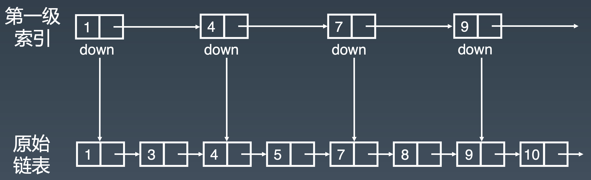
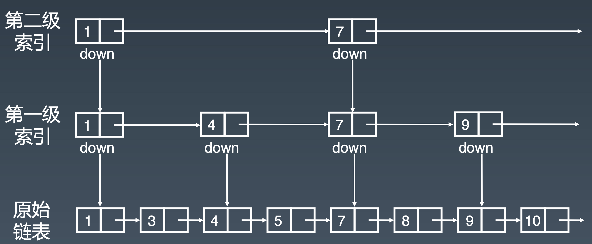
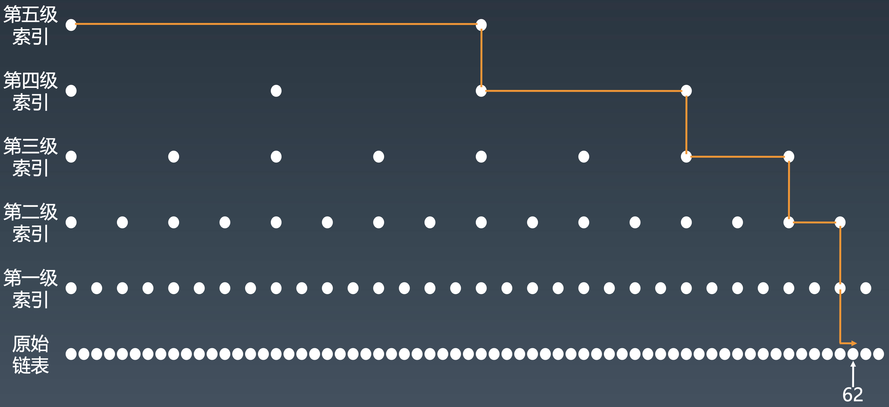
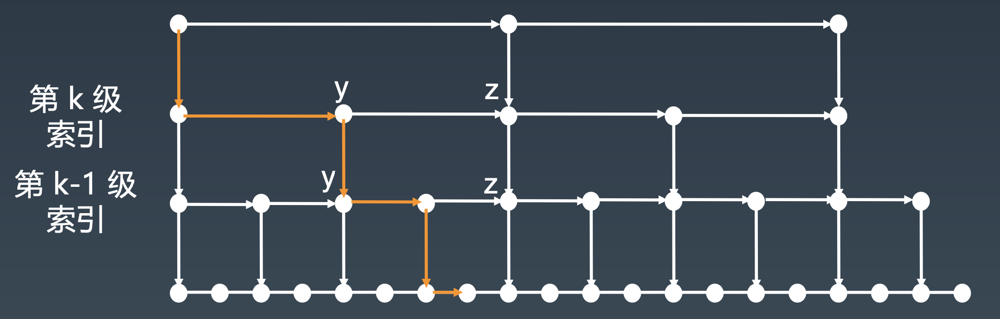
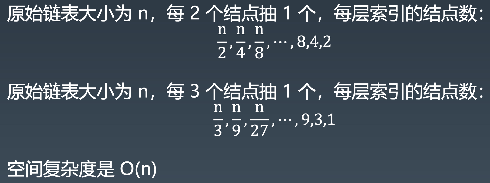

# 跳表
> 链表的查询是O(n)的，那么如果数据存储在链表中，能不能有其它办法提高查询效率呢
实际上，只需要对链表稍加改造，就可以支持类似“二分”的查找算法。我们把改造之后的数据结构叫做跳表（Skip list）
## 说明
跳表(skip list)对标的是平衡树(AVL Tree)和二分查找， 是一种插入/删除/搜索 都是 O(log n) 的数据结构。1989 年出现。
它最大的优势是原理简单、容易实现、方便扩展、效率更高。因此 在一些热门的项目里用来替代平衡树，如 Redis、LevelDB 等。
**注意:跳表只能用于元素有序的情况**

## 如何理解“跳表”？
对于一个单链表来讲，即便链表中存储的数据是有序的，如果我们要想在其中查找某个数据，也只能从头到尾遍历链表。这样查找效率就会很低，时间复杂度会很高，是 O(n)。

如果对链表建立一级“索引”，查找起来是不是就会更快一些呢？每两个结点提取一个结点到上一级，我们把抽出来的那一级叫做索引或索引层。图中的 down 表示 down 指针，指向下一级结点。

可以看出，加来一层索引之后，查找一个结点需要遍历的结点个数减少了，也就是说查找效率提高了。那如果我们再加一级索引呢？效率会不会提升更多呢？

以此类推，增加多级索引

从图中我们可以看出，原来没有索引的时候，查找 62 需要遍历 62 个结点，现在只需要遍历 11 个结点，速度提高了很多

**这种链表加多级索引的结构，就是跳表。**

##  跳表查询的时间复杂度分析
按照我们刚才讲的，每两个结点会抽出一个结点作为上一级索引的结点，那第一级索引的结点个数大约就是 n/2，第二级索引的结点个数大约就是 n/4，第三级索引的结点个数大约就是 n/8，依次类推，也就是说，第 k 级索引的结点个数是第 k-1 级索引的结点个数的 1/2，那第 k级索引结点的个数就是 n/(2^k)。
假设索引有 h 级，最高级的索引有 2 个结点。n/(2^h) = 2，从而求得 h = log2(n)-1

索引的高度:logn，每层索引遍历的结点个数:3 在跳表中查询任意数据的时间复杂度就是 O(logn)

##  跳表的空间复杂度分析

假设原始链表大小为 n，那第一级索引大约有 n/2 个结点，第二级索引大约有 n/4 个结点，以此类推，每上升一级就减少一半，直到剩下 2 个结点。如果我们把每层索引的结点数写出来，就是一个等比数列。
这几级索引的结点总和就是 n/2+n/4+n/8…+8+4+2=n-2。所以，跳表的空间复杂度是 O(n)。也就是说，如果将包含 n 个结点的单链表构造成跳表，我们需要额外再用接近 n 个结点的存储空间。

如果每三个结点抽一个，第一级索引需要大约 n/3 个结点，第二级索引需要大约 n/9 个结点。每往上一级，索引结点个数都除以 3。为了方便计算，我们假设最高一级的索引结点个数是 1。我们把每级索引的结点个数都写下来，也是一个等比数列。

通过等比数列求和公式，总的索引结点大约就是 n/3+n/9+n/27+…+9+3+1=n/2。尽管空间复杂度还是 O(n)，但比上面的每两个结点抽一个结点的索引构建方法，要减少了一半的索引结点存储空间。

## 动态插入和删除
#### 插入
查找某个结点的时间复杂度是 O(logn)，所以这里查找某个数据应该插入的位置，方法也是类似的，时间复杂度也是 O(logn)。

#### 删除
如果这个结点在索引中也有出现，我们除了要删除原始链表中的结点，还要删除索引中的。因为单链表中的删除操作需要拿到要删除结点的前驱结点，然后通过指针操作完成删除。所以在查找要删除的结点的时候，一定要获取前驱结点。当然，如果我们用的是双向链表，就不需要考虑这个问题了。

## 跳表索引动态更新
当我们不停地往跳表中插入数据时，如果我们不更新索引，就有可能出现某 2 个索引结点之间数据非常多的情况。极端情况下，跳表还会退化成单链表。

可以通过一个随机函数，来决定将这个结点插入到哪几级索引中，比如随机函数生成了值 K，那我们就将这个结点添加到第一级到第 K 级这 K 级索引中。

## 为什么 Redis 要用跳表来实现有序集合，而不是红黑树？
>Redis 中的有序集合是通过跳表来实现的，严格点讲，其实还用到了散列表等其它数据结构，但是这里只记录跳表。

Redis 中的有序集合支持的核心操作主要有下面这几个：
- 插入一个数据；
- 删除一个数据；
- 查找一个数据；
- 按照区间查找数据（比如查找值在[100, 356]之间的数据）；
- 迭代输出有序序列。

其中，插入、删除、查找以及迭代输出有序序列这几个操作，红黑树也可以完成，时间复杂度跟跳表是一样的。**但是，按照区间来查找数据这个操作，红黑树的效率没有跳表高。**

- 对于按照区间查找数据这个操作，跳表可以做到 O(logn) 的时间复杂度定位区间的起点，然后在原始链表中顺序往后遍历就可以了。这样做非常高效。

还有其他原因，比如，跳表更容易代码实现。虽然跳表的实现也不简单，但比起红黑树来说还是好懂、好写多了，而简单就意味着可读性好，不容易出错。还有，跳表更加灵活，它可以通过改变索引构建策略，有效平衡执行效率和内存消耗。

不过，跳表也不能完全替代红黑树。因为红黑树比跳表的出现要早一些，很多编程语言中的 Map 类型都是通过红黑树来实现的。做业务开发的时候，直接拿来用就可以了，不用费劲自己去实现一个红黑树，但是跳表并没有一个现成的实现，所以在开发中，如果你想使用跳表，必须要自己实现。

