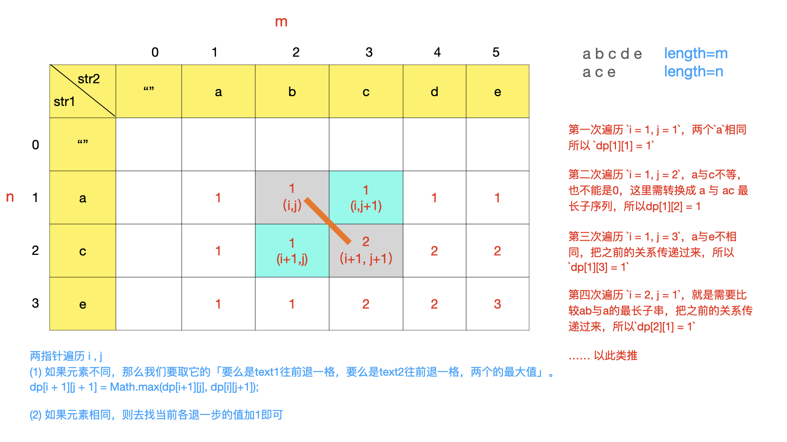

## 1143. 最长公共子序列
>链接：https://leetcode-cn.com/problems/longest-common-subsequence

给定两个字符串 text1 和 text2，返回这两个字符串的最长公共子序列的长度。

一个字符串的 子序列 是指这样一个新的字符串：它是由原字符串在不改变字符的相对顺序的情况下删除某些字符（也可以不删除任何字符）后组成的新字符串。
例如，"ace" 是 "abcde" 的子序列，但 "aec" 不是 "abcde" 的子序列。两个字符串的「公共子序列」是这两个字符串所共同拥有的子序列。

若这两个字符串没有公共子序列，则返回 0。

 

示例 1:
输入：text1 = "abcde", text2 = "ace" 
输出：3  
解释：最长公共子序列是 "ace"，它的长度为 3。

示例 2:
输入：text1 = "abc", text2 = "abc"
输出：3
解释：最长公共子序列是 "abc"，它的长度为 3。

示例 3:
输入：text1 = "abc", text2 = "def"
输出：0
解释：两个字符串没有公共子序列，返回 0。
 

提示:

1 <= text1.length <= 1000
1 <= text2.length <= 1000
输入的字符串只含有小写英文字符。

### 思路一：动态规划
- 重复子问题：每两个字符串都可以看做由前两个对应的子字符串的公共子序列计算出来
    - 如果text1和text2的最后一个字符相等，那就最长公共子序列可以由text1和text2去掉最后这种相等字符的最长公共序列再加上这个相等的字符；
    - 如果最后一个字符不相等，那就表明最后这个字符对当前text1和text2的最长公共子序列可能没有影响，所以就可以分别去掉最后这一个字符再分别计算剩余的公共子序列，由于是可能没有影响，所以我们需要计算两者中的最大值
- 中间状态：opt[i][j]
- dp方程：
    - If S1[-1] != S2[-1]: LCS[s1, s2] = Max(LCS[s1-1, s2], LCS[s1, s2-1])
    - If S1[-1] == S2[-1]: LCS[s1, s2] = LCS[s1-1, s2-1] + 1

#### 代码实现
```python
class Solution:
    def longestCommonSubsequence(self, text1: str, text2: str) -> int:
        if not text1 or not text2: return 0
        m, n = len(text1), len(text2)
        opt = [[0] * (n+1) for _ in range(m+1)]
        for i in range(1,m+1):
            for j in range(1,n+1):
                if text1[i - 1] == text2[j - 1]:
                    opt[i][j] = opt[i-1][j-1] + 1
                else:
                    opt[i][j] = max(opt[i-1][j], opt[i][j-1])
        return opt[m][n]
```
在这里，使用了一个空引号作为哨兵，识得计算可以简化，否则如果按 62 题的逻辑，opt的第一列和第一行分别代表text1和text2的第一个字符对应的结果值的话，我们就需要先单独计算出这第一列和第一行的值，即初始化opt[0][j] 和 opt[i][0]，就比较麻烦，i和j表示的其实是text1和text2的长度


