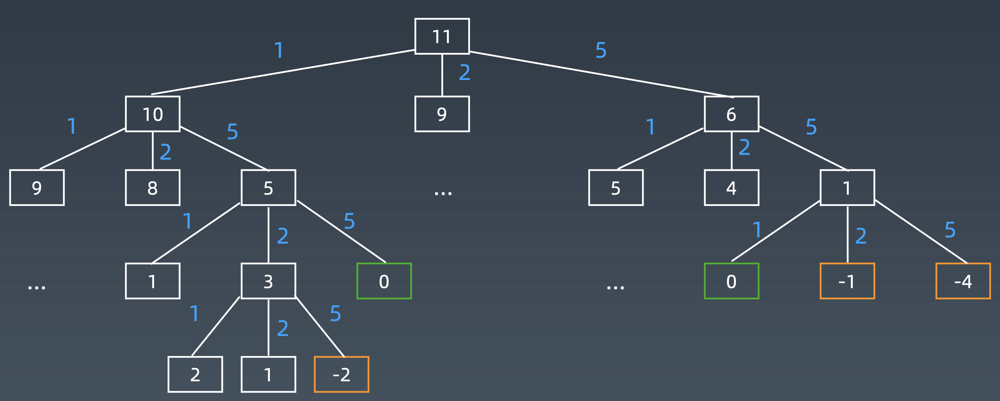

## 322. 零钱兑换
>链接：https://leetcode-cn.com/problems/coin-change


给定不同面额的硬币 coins 和一个总金额 amount。编写一个函数来计算可以凑成总金额所需的最少的硬币个数。如果没有任何一种硬币组合能组成总金额，返回 -1。

你可以认为每种硬币的数量是无限的。

示例 1：
输入：coins = [1, 2, 5], amount = 11
输出：3 
解释：11 = 5 + 5 + 1

示例 2：
输入：coins = [2], amount = 3
输出：-1

示例 3：
输入：coins = [1], amount = 0
输出：0

示例 4：
输入：coins = [1], amount = 1
输出：1

示例 5：
输入：coins = [1], amount = 2
输出：2
 
提示：
1 <= coins.length <= 12
1 <= coins[i] <= 2^31^ - 1
0 <= amount <= 10^4^

### 思路一：BFS（DFS也可以，但是觉得没有BFS方便，懒得写）
从目标金额开始，每一个硬币都可以选择取或者不取，就会得到不同的剩余金额，剩余金额同样可以选择取或者不取某一个硬币继续得到剩余金额，直到剩余金额为小于等于0，那么就可以得到该目标金额的状态树，如

我们只需要找到第一个为0的节点，该节点的深度就是所需要的硬币数。所以需要用BFS来查找。
另外，由于目标金额过大且硬币面额较小时，树的深度会很大，且有很多重复的节点，需要增加一个visited，来避免重复计算
#### 代码实现
```python
class Solution:
    def coinChange(self, coins: List[int], amount: int) -> int:
        if amount == 0: return 0
        queue, level, visited = [amount], 0, set()
        while queue:
            new = []
            for i in queue:
                if i == 0:return level
                if i < 0 or i in visited: continue
                new.extend([i - j for j in coins])
                visited.add(i)
            queue,level = new, level+1
        return -1
```

### 思路二：动态规划
- 重复子问题：类似于爬楼梯问题，要爬到第n层阶梯，每次可以爬k (k in coins)步，需要最少的步数，所以当前最少的硬币数就是只需要 1 个硬币就能组成，且前面组成的个数最少
- 中间状态：opt[i]，i表示组成金额
- dp方程: opt[i] = min(opt[i-k]) + 1 (k in coins)

#### 代码实现
```python
class Solution:
    def coinChange(self, coins: List[int], amount: int) -> int:
        if amount == 0: return 0
        opt = [0] * (amount + 1)
        opt[0] = 0
        for i in range(1, amount + 1):
            min_k = float('inf')
            for k in coins:
                if k<=i and opt[i-k] < min_k:
                    min_k=opt[i-k] + 1
            opt[i] = min_k
        return opt[amount] if opt[amount] !=float('inf') else -1
```

简洁版
```python
class Solution:
    def coinChange(self, coins: List[int], amount: int) -> int:
        if amount == 0: return 0
        opt = [0] * (amount + 1)
        opt[0] = 0
        for i in range(1, amount + 1):
            min_k = [opt[i-k]+1 for k in coins if k<=i ]
            opt[i] = (min(min_k)) if min_k else float('inf')
        return opt[amount] if opt[amount] !=float('inf') else -1
```
#### 复杂度分析：

- 时间复杂度：O(N×amount)，这里 N 是可选硬币的种类数，amount 是题目输入的面值；
- 空间复杂度：O(amount)，状态数组的大小为 amount。

### 思路三：贪心+剪枝
一般来说，每次使用的硬币面额越大，使用的硬币数量会越少，这也是贪心的思想，但是有些情况贪心并不能得到最优解，如[1,7,10] 和 14的情况，直接贪心会得到 10，1，1，1，1共5个硬币，但是实际上 7，7两个硬币才是最优解。
所以，我们还是要穷举所有结果，但是我们可以从最大的硬币面额开始，记录每次的个数和最小值，当当前次数已经大于最小值时就没必要继续往下了，也就是剪枝

乘法对加法的加速
优先丢大硬币进去尝试，也没必要一个一个丢，可以用乘法算一下最多能丢几个
k = amount / coins[c_index] 计算最大能投几个
amount - k * coins[c_index] 减去扔了 k 个硬币后余额
count + k 加 k 个硬币

如果因为丢多了导致最后无法凑出总额，再回溯减少大硬币数量

#### 代码实现
```python
class Solution:
    def coinChange(self, coins: List[int], amount: int) -> int:
        if amount == 0: return 0
        n, self.res = len(coins), float('inf')
        def dfs(count, less, index):
            if less == 0: 
                self.res = min(count, self.res)
                return
            if index < 0: return 
            for i in range(less//coins[index], -1, -1):
                if i+count<self.res:
                    dfs(count+i, less-i*coins[index], index-1)
                else:
                    break
        coins.sort()
        dfs(0, amount, n-1)
        return self.res if self.res!=float('inf') else -1
```


