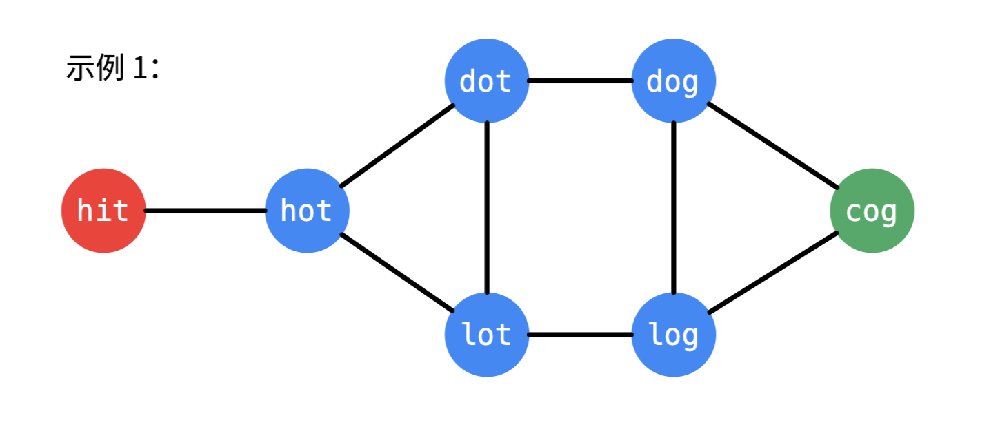

## 127. 单词接龙
给定两个单词（beginWord 和 endWord）和一个字典，找到从 beginWord 到 endWord 的最短转换序列的长度。转换需遵循如下规则：

每次转换只能改变一个字母。
转换过程中的中间单词必须是字典中的单词。
说明:

如果不存在这样的转换序列，返回 0。
所有单词具有相同的长度。
所有单词只由小写字母组成。
字典中不存在重复的单词。
你可以假设 beginWord 和 endWord 是非空的，且二者不相同。
示例 1:
```shell
输入:
beginWord = "hit",
endWord = "cog",
wordList = ["hot","dot","dog","lot","log","cog"]

输出: 5

解释: 一个最短转换序列是 "hit" -> "hot" -> "dot" -> "dog" -> "cog",
     返回它的长度 5。
```
示例 2:
```shell
输入:
beginWord = "hit"
endWord = "cog"
wordList = ["hot","dot","dog","lot","log"]

输出: 0

解释: endWord "cog" 不在字典中，所以无法进行转换。
```


#### 思路一：回溯
>这道题跟基因变化 [443题](https://leetcode-cn.com/problems/minimum-genetic-mutation) 类似，可以用同样的思路来进行回溯
- 判断当前字符串和目标是否相等，是则获取 当前记录次数和当前最小次数的最小值
- 遍历单词库，查找与当前字符串之差一个字符的元素，并将其记录为访问
- 将当前记录集合和上面找到的元素作为参数传入第二层递归，清除当前层的访问记录
- 判断当前传入元素是否已经访问过，不是则递归重复上述步骤


#### 代码实现
```python
class Solution:
    def ladderLength(self, beginWord: str, endWord: str, wordList: List[str]) -> int:
        wordSet, n = set(wordList), len(endWord)
        if endWord not in wordSet: return 0
        self.min = float('inf')
        def backtrack(visited, cur_str, cur_edit):
            if cur_str == endWord:
                self.min = min(self.min, cur_edit + 1)
                return 
            for s in wordSet:
                diff = 0
                for i in range(n):
                    if s[i] != cur_str[i]:
                        diff += 1
                    if diff > 1: break
                if diff == 1 and s not in visited:
                    visited.add(s)
                    backtrack(visited, s, cur_edit + 1)
                    visited.remove(s)
        backtrack(set(), beginWord, 0)
        return self.min if self.min != float('inf') else 0
```
**然而超时了。。。**，这道题和443题类似，但是443题的基因库是 最多只有4个不同字符组成，而这道题中的单词库有26个不同的字符，回溯的次数远远多于443题，回溯的时间复杂度非常高，在此不适用。

### 思路二：bfs

如上图所示，从startWord开始，对它能改变的所有字符的结果做为一个子节点，再从每个子节点的所有改变每个字符的结果作为他们的子节点，但是这样构造出来的树非常大。
实际上，由于题目要求每次中间结果都需要存在于给定的列表中，所以我们可以直接过滤掉那些不属于列表中的结果字符串，同时为了提高判断是否存在列表中，可以将 wordList 改成一个set集合，判断操作提升为O(1)。
然后我们用层次遍历的方式，遍历所构造的树（实际上应该是图，但是为了方便理解，将其重复节点提取出来，构造为树），对将它改动一个字符后结果与endWord比较，相等则返回，否则判断是否访问过，如果没有范访问过则作为下一层的节点加入到队列中。
每一层遍历完成后，修改次数都要加1。
由于题目要求返回的是转换路径的长度，而上面计算出的step是根节点startWord到叶子节点endWord的路径数，所以返回时还需要 + 1。


#### 代码实现：
```python
class Solution:
    def ladderLength(self, beginWord: str, endWord: str, wordList: List[str]) -> int:
        wordSet, n, step = set(wordList), len(endWord), 0
        if endWord not in wordSet: return 0
        queue, visited = [beginWord], set(beginWord)
        while queue:
            new = []
            for word in queue:
                for i in range(n):
                    for ch in 'abcdefghijklmnopqrstuvwxyz':
                        if ch == word[i]: continue
                        net_word = word[:i] + ch + word[i+1:]
                        if net_word in wordSet:
                            if net_word == endWord:
                                step += 1
                                return step + 1
                            if net_word not in visited:
                                new.append(net_word)
                                visited.add(net_word)
            step += 1
            queue = new
        return 0
```
#### 复杂度分析
时间复杂度：O(M×N)，其中 M 是单词的长度 N 是单词表中单词的总数。找到所有的变换需要对每个单词做 M 次操作。同时，最坏情况下广度优先搜索也要访问所有的 N 个单词。
空间复杂度：O(M×N)，要在 visited 字典中记录每个单词的 M 个通用状态。访问数组的大小是 N。广搜队列最坏情况下需要存储 N 个单词。


### 思路三：双向BFS
- 已知目标顶点的情况下，可以分别从起点和目标顶点（终点）执行广度优先遍历，直到遍历的部分有交集。这种方式搜索的单词数量会更小一些；
- 更合理的做法是，每次从单词数量小的集合开始扩散，这里 s_queue 和 e_queue 交替使用，每次都从小的那个开始遍历，等价于单向 BFS 里使用队列，每次扩散都要加到总的 visited 里。
- 与前面BFS相比，修改的代码只有：
     - 增加从目标为起点的队列和访问记录
     - 当len(s_queue) > len(e_queue)时，交换两个队列和访问记录，保证每次从单词数量小的队列开始扩散
     - 返回条件由 word == endWord 改为当两个访问记录有交集时返回

#### 代码实现
```python
class Solution:
    def ladderLength(self, beginWord: str, endWord: str, wordList: List[str]) -> int:
        wordSet, n, step = set(wordList), len(endWord), 0
        if endWord not in wordSet: return 0
        s_queue, e_queue, s_visited, e_visited = [beginWord], [endWord],set(beginWord), set(endWord)
        while s_queue :
            if len(e_queue) < len(s_queue):
                s_queue, e_queue = e_queue, s_queue
                s_visited, e_visited = e_visited, s_visited
            new = []
            for word in s_queue:
                for i in range(n):
                    for ch in 'abcdefghijklmnopqrstuvwxyz':
                        if ch == word[i]: continue
                        net_word = word[:i] + ch + word[i+1:]
                        if net_word in wordSet:
                            if net_word in e_queue:
                                step += 1
                                return step + 1
                            if net_word not in s_visited:
                                new.append(net_word)
                                s_visited.add(net_word)
            step += 1
            s_queue = new
        return 0
```


#### 复杂度分析
时间复杂度：O(M×N)，其中 M 是单词的长度 N 是单词表中单词的总数。找到所有的变换需要对每个单词做 M 次操作。同时，最坏情况下广度优先搜索也要访问所有的 N 个单词。但是搜索时间会被缩小一半，因为两个搜索会在中间某处相遇。
空间复杂度：O(M×N)，要在 visited 字典中记录每个单词的 M 个通用状态。访问数组的大小是 N。广搜队列最坏情况下需要存储 N 个单词。


