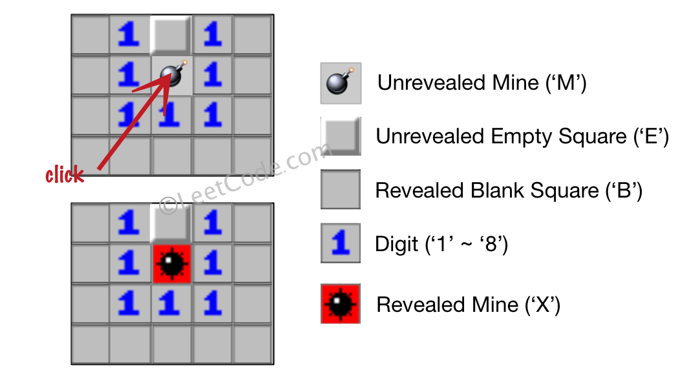

## 扫雷游戏
>链接：https://leetcode-cn.com/problems/minesweeper

给定一个代表游戏板的二维字符矩阵。 'M' 代表一个未挖出的地雷，'E' 代表一个未挖出的空方块，'B' 代表没有相邻（上，下，左，右，和所有4个对角线）地雷的已挖出的空白方块，数字（'1' 到 '8'）表示有多少地雷与这块已挖出的方块相邻，'X' 则表示一个已挖出的地雷。

现在给出在所有未挖出的方块中（'M'或者'E'）的下一个点击位置（行和列索引），根据以下规则，返回相应位置被点击后对应的面板：

1. 如果一个地雷（'M'）被挖出，游戏就结束了- 把它改为 'X'。
2. 如果一个没有相邻地雷的空方块（'E'）被挖出，修改它为（'B'），并且所有和其相邻的未挖出方块都应该被递归地揭露。
3. 如果一个至少与一个地雷相邻的空方块（'E'）被挖出，修改它为数字（'1'到'8'），表示相邻地雷的数量。
4. 如果在此次点击中，若无更多方块可被揭露，则返回面板。
 

示例 1：
```shell
输入: 

[['E', 'E', 'E', 'E', 'E'],
 ['E', 'E', 'M', 'E', 'E'],
 ['E', 'E', 'E', 'E', 'E'],
 ['E', 'E', 'E', 'E', 'E']]

Click : [3,0]

输出: 

[['B', '1', 'E', '1', 'B'],
 ['B', '1', 'M', '1', 'B'],
 ['B', '1', '1', '1', 'B'],
 ['B', 'B', 'B', 'B', 'B']]

解释:
```

示例 2：
```shell
输入: 

[['B', '1', 'E', '1', 'B'],
 ['B', '1', 'M', '1', 'B'],
 ['B', '1', '1', '1', 'B'],
 ['B', 'B', 'B', 'B', 'B']]

Click : [1,2]

输出: 

[['B', '1', 'E', '1', 'B'],
 ['B', '1', 'X', '1', 'B'],
 ['B', '1', '1', '1', 'B'],
 ['B', 'B', 'B', 'B', 'B']]
```
解释:


 

注意：

1. 输入矩阵的宽和高的范围为 [1,50]。
2. 点击的位置只能是未被挖出的方块 ('M' 或者 'E')，这也意味着面板至少包含一个可点击的方块。
3. 输入面板不会是游戏结束的状态（即有地雷已被挖出）。
4. 简单起见，未提及的规则在这个问题中可被忽略。例如，当游戏结束时你不需要挖出所有地雷，考虑所有你可能赢得游戏或标记方块的情况。

### 思路一：递归+dfs
- 当前点击的是「未挖出的地雷」，我们将其值改为 X 即可。
- 当前点击的是「未挖出的空方块」，我们需要统计它周围相邻的方块里地雷的数量 cnt（即 M 的数量）。如果 cnt 为零，即执行规则 2，此时需要将其改为 B，且递归地处理周围的八个未挖出的方块，递归终止条件即为规则 4，没有更多方块可被揭露的时候。否则执行规则 3，将其修改为数字即可。
- 整体看来，一次点击过程会从一个位置出发，逐渐向外圈扩散，所以这引导我们利用「搜索」的方式来实现。这里以深度优先搜索为例：我们定义递归函数 dfs(x, y) 表示当前在 (x,y) 点，执行扫雷规则的情况，我们只要按照上面理出来的情况来进行模拟即可，在 cnt 为零的时候，对当前点相邻的未挖出的方块调用递归函数，否则将其改为数字，结束递归。

#### 代码实现
```python
class Solution:
    def updateBoard(self, board: List[List[str]], click: List[int]) -> List[List[str]]:
        x, y = click[0], click[1]
        chan = [(1, 0), (-1, 0), (0, 1), (0, -1), (1, 1), (-1, 1), (-1, -1), (1, -1)]
        if board[x][y] == 'M': # 规则 1
            board[x][y] = 'X'
            return board
        def dfs(i, j):
            cnt = 0
            for (x_to, y_to) in chan:
                x_to, y_to = i + x_to, j + y_to
                if x_to >= 0 and y_to >= 0 and x_to < len(board) and y_to < len(board[0]) and board[x_to][y_to] == 'M' :
                    cnt += 1
            if cnt > 0: #规则 3
                board[i][j] = str(cnt)
            else : # 规则 2
                board[i][j] = 'B'
                for (x_to, y_to) in chan:
                    x_to, y_to = i + x_to, j + y_to
                    if x_to >= 0 and y_to >= 0 and x_to < len(board) and y_to < len(board[0]) and board[x_to][y_to] == 'E' :
                        dfs(x_to, y_to)
        dfs(x,y)
        return board
```

#### 复杂度分析

时间复杂度：O(nm)，其中 n 和 m 分别代表面板的宽和高。最坏情况下会遍历整个面板。
空间复杂度：O(nm)。空间复杂度取决于递归的栈深度，而递归栈深度在最坏情况下有可能遍历整个面板而达到 O(nm)。

### 思路二： bfs
#### 代码实现
```python
class Solution:
    def updateBoard(self, board: List[List[str]], click: List[int]) -> List[List[str]]:
        x, y = click[0], click[1]
        chan = [(1, 0), (-1, 0), (0, 1), (0, -1), (1, 1), (-1, 1), (-1, -1), (1, -1)]
        if board[x][y] == 'M':
            board[x][y] = 'X'
            return board
        queue, visited = [(x,y)], [[False]*len(board[0]) for i in range(len(board))]
        visited[x][y] = True
        while queue:
            new = []
            for x,y in queue:
                cnt = 0
                for (x_to, y_to) in chan:
                    x_to, y_to = x + x_to, y + y_to
                    if x_to >= 0 and y_to >= 0 and x_to < len(board) and y_to < len(board[0]) and board[x_to][y_to] == 'M' :
                        cnt += 1
                if cnt > 0:
                    board[x][y] = str(cnt)
                else : 
                    board[x][y] = 'B'
                    for (x_to, y_to) in chan:
                        x_to, y_to = x + x_to, y + y_to
                        if x_to >= 0 and y_to >= 0 and x_to < len(board) and y_to < len(board[0]) and board[x_to][y_to] == 'E' and not visited[x_to][y_to]:
                            
                            new.append((x_to, y_to))
                            visited[x_to][y_to] = True
            queue = new
        return board
```
#### 复杂度分析
- 时间复杂度：O(nm)，其中 n 和 m 分别代表面板的宽和高。最坏情况下会遍历整个面板。
- 空间复杂度：O(nm)。我们需要 O(nm) 的标记数组来标记当前位置是否已经被加入队列防止重复计算，以及 存储元素的队列，但是队列一次最多也只存8个，所以还是O(nm)。


