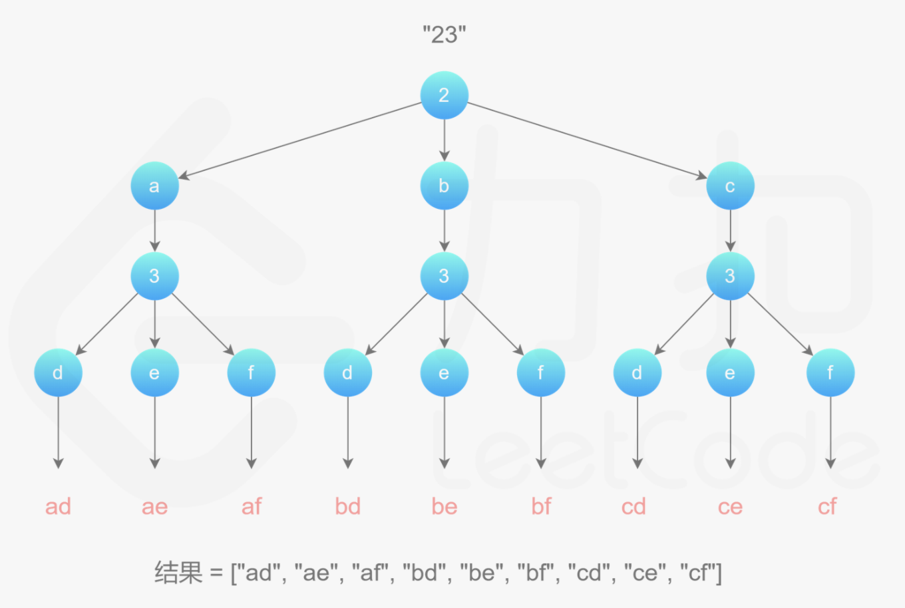

## 17. 电话号码的字母组合
>链接：https://leetcode-cn.com/problems/letter-combinations-of-a-phone-number

给定一个仅包含数字 2-9 的字符串，返回所有它能表示的字母组合。

给出数字到字母的映射如下（与电话按键相同）。注意 1 不对应任何字母。


示例:

输入："23"
输出：["ad", "ae", "af", "bd", "be", "bf", "cd", "ce", "cf"].
说明:
尽管上面的答案是按字典序排列的，但是你可以任意选择答案输出的顺序。

### 思路一：回溯
首先使用哈希表存储每个数字对应的所有可能的字母，然后进行回溯操作。

回溯过程中维护一个字符串，表示已有的字母排列（如果未遍历完电话号码的所有数字，则已有的字母排列是不完整的）。该字符串初始为空。每次取电话号码的一位数字，从哈希表中获得该数字对应的所有可能的字母，并将其中的一个字母插入到已有的字母排列后面，然后继续处理电话号码的后一位数字，直到处理完电话号码中的所有数字，即得到一个完整的字母排列。然后进行回退操作，遍历其余的字母排列。

回溯算法用于寻找所有的可行解，如果发现一个解不可行，则会舍弃不可行的解。在这道题中，由于每个数字对应的每个字母都可能进入字母组合，因此不存在不可行的解，直接穷举所有的解即可。

首先构建一个map，记录数字和其对应字母的关系，然后遍历第一个数组，尝试将其元素的所有组合都列举（通过递归进入下一层），然后把当前元素去掉，重复上述步骤


#### 代码实现
```python
class Solution:
    def letterCombinations(self, digits: str) -> List[str]:
        if len(digits) == 0: return []
        num_char = {
            '2':['a', 'b', 'c'],
            '3':['d','e','f'],
            '4':['g','h','i'],
            '5':['j','k','l'],
            '6':['m', 'n', 'o'],
            '7':['p','q','r', 's'],
            '8':['t','u','v'],
            '9':['w','x','y', 'z'],
        }
        res,n = [],len(digits)
        def backtrack(begin, cur_path):
            if len(cur_path) == n:
                res.append(''.join(cur_path))
                return
            digit = digits[begin]
            for ch in num_char.get(digit, ''):
                cur_path.append(ch)
                backtrack(begin+1, cur_path)
                cur_path.pop()
        backtrack(0,[])
        return res 
```
#### 复杂度分析
- 时间复杂度：O(3^m^ * 4^n^)，其中 m 是输入中对应 3 个字母的数字个数（包括数字 2、3、4、5、6、8），n 是输入中对应 4 个字母的数字个数（包括数字 7、9），m+n 是输入数字的总个数。当输入包含 m 个对应 3 个字母的数字和 n 个对应 4 个字母的数字时，不同的字母组合一共有3^m^ * 4^n^种，需要遍历每一种字母组合。

- 空间复杂度：O(m+n)，其中 m 是输入中对应 3 个字母的数字个数，n 是输入中对应 4 个字母的数字个数，m+n 是输入数字的总个数。除了返回值以外，空间复杂度主要取决于哈希表以及回溯过程中的递归调用层数，哈希表的大小与输入无关，可以看成常数，递归调用层数最大为 m+n。


### 思路二：队列（bfs）
对于所有字符串的组合，可以画成一个n叉树，树的叶子节点就是所有结果，对于上面回溯的过程，实际上就是这个树的dfs，找到叶子节点时将其添加到结果。

所以，也可以用队列来实现这个n叉树的bfs
#### 代码实现
```python
import collections
class Solution:
    def letterCombinations(self, digits: str) -> List[str]:
        if len(digits) == 0: return []
        num_char = {
            '2':['a', 'b', 'c'],
            '3':['d','e','f'],
            '4':['g','h','i'],
            '5':['j','k','l'],
            '6':['m', 'n', 'o'],
            '7':['p','q','r', 's'],
            '8':['t','u','v'],
            '9':['w','x','y', 'z'],
        }
        res,n = collections.deque([""]),len(digits)
        for dig in digits:
            size = len(res)
            for _ in range(size):
                tmp = res.popleft()
                for ch in num_char.get(dig, ''):
                    res.append(tmp+ch)
        return res
```
- 时间复杂度：O(3^m^ * 4^n^)，其中 m 是输入中对应 3 个字母的数字个数（包括数字 2、3、4、5、6、8），n 是输入中对应 4 个字母的数字个数（包括数字 7、9），m+n 是输入数字的总个数。当输入包含 m 个对应 3 个字母的数字和 n 个对应 4 个字母的数字时，不同的字母组合一共有3^m^ * 4^n^种，需要遍历每一种字母组合。

- 空间复杂度：O(3^m^ * 4^n^)，其中 m 是输入中对应 3 个字母的数字个数，n 是输入中对应 4 个字母的数字个数，m+n 是输入数字的总个数。除了返回值以外，空间复杂度主要取决于哈希表以及队列的开销，哈希表的大小与输入无关，队列的开销为 3^m^ * 4^n^


