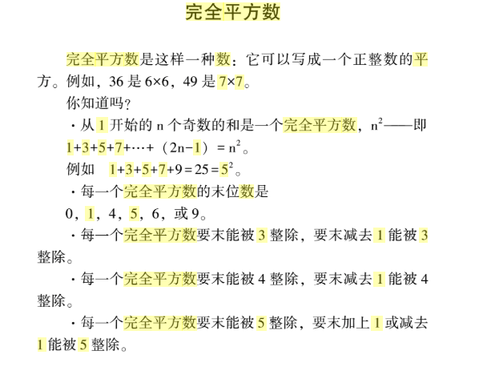

## 367. 有效的完全平方数
>链接：https://leetcode-cn.com/problems/valid-perfect-square

给定一个正整数 num，编写一个函数，如果 num 是一个完全平方数，则返回 True，否则返回 False。

说明：不要使用任何内置的库函数，如  sqrt。

示例 1：
输入：16
输出：True

示例 2：
输入：14
输出：False

### 思路一：二分查找
这道题和 69 题求平方根的思路差不多，只需要在二分的过程中，找到mid的平方等于num的直接返回true即可，其它情况表示没找到数的平方=num，表明num不是完全平方数
#### 代码实现
```python
class Solution:
    def isPerfectSquare(self, num: int) -> bool:
        left, right = 0, num
        while left <= right:
            mid = left + ((right - left) >> 1)
            sq = mid * mid
            if sq ==  num:
                return True
            if sq > num:
                right = mid - 1
            else:
                left = mid + 1
        return False
```

#### 复杂度分析

时间复杂度：O(logx)，即为二分查找需要的次数。
空间复杂度：O(1)。

### 思路二：牛顿迭代法
和69题一样，迭代公式 x = 1/2 *(x~0~ + a/x~0~)
其中 x 就是 最后判断是否收敛至 对应根号a的值，x~0~ 为每次迭代时传入的上次计算出的 x 值，a为要计算的整数。
只需要判断最后迭代得到的那个值的平方是否 == num即可。
#### 代码实现
```python
class Solution:
    def isPerfectSquare(self, num: int) -> bool:
        item = num
        while item * item > num:
            item = (item + num/item) // 2
        return item * item == num
```

### 思路三：完全平方数性质
完全平方数可以通过累加从1往后的奇数找到，

1 = 1;
4 = 1 + 3;
9 = 1 + 3 + 5;
16 = 1 + 3 + 5 + 7;

#### 代码实现
```python
class Solution:
    def isPerfectSquare(self, num: int) -> bool:
        i = 1
        while num > 0:
            num -= i
            i += 2
        return num == 0
```

