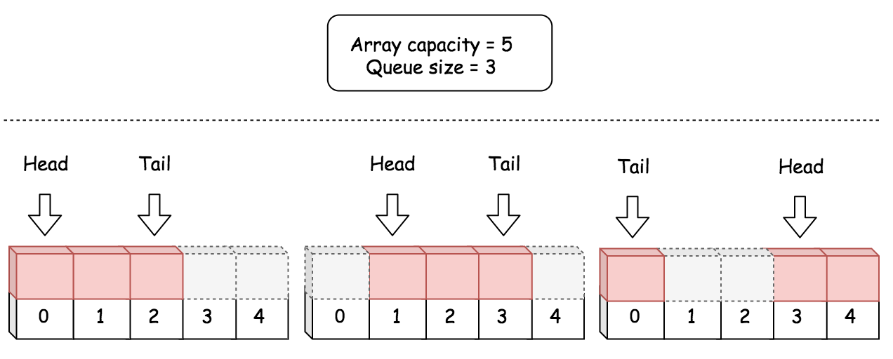

## 622. Design Circular Queue
> medium
链接：https://leetcode-cn.com/problems/design-circular-queue

设计你的循环队列实现。 循环队列是一种线性数据结构，其操作表现基于 FIFO（先进先出）原则并且队尾被连接在队首之后以形成一个循环。它也被称为“环形缓冲器”。

循环队列的一个好处是我们可以利用这个队列之前用过的空间。在一个普通队列里，一旦一个队列满了，我们就不能插入下一个元素，即使在队列前面仍有空间。但是使用循环队列，我们能使用这些空间去存储新的值。

你的实现应该支持如下操作：

MyCircularQueue(k): 构造器，设置队列长度为 k 。
Front: 从队首获取元素。如果队列为空，返回 -1 。
Rear: 获取队尾元素。如果队列为空，返回 -1 。
enQueue(value): 向循环队列插入一个元素。如果成功插入则返回真。
deQueue(): 从循环队列中删除一个元素。如果成功删除则返回真。
isEmpty(): 检查循环队列是否为空。
isFull(): 检查循环队列是否已满。
 

示例：

MyCircularQueue circularQueue = new MyCircularQueue(3); // 设置长度为 3
circularQueue.enQueue(1);  // 返回 true
circularQueue.enQueue(2);  // 返回 true
circularQueue.enQueue(3);  // 返回 true
circularQueue.enQueue(4);  // 返回 false，队列已满
circularQueue.Rear();  // 返回 3
circularQueue.isFull();  // 返回 true
circularQueue.deQueue();  // 返回 true
circularQueue.enQueue(4);  // 返回 true
circularQueue.Rear();  // 返回 4

提示：
所有的值都在 0 至 1000 的范围内；
操作数将在 1 至 1000 的范围内；
请不要使用内置的队列库。

### 思路一：数组实现一
任何数据结构中都不存在环形结构，但是可以使用一维 数组 模拟，通过操作数组的索引构建一个 虚拟 的环。很多复杂数据结构都可以通过数组实现。
1、定义循环变量 front 和 rear 。一直保持这个定义，到底是先赋值还是先移动指针就很容易想清楚了。

front：指向队列头部第 1 个有效数据的位置；
rear：指向队列尾部（即最后 1 个有效数据）的下一个位置，即下一个从队尾入队元素的位置。

（说明：这个定义是依据“动态数组”的定义模仿而来。）

2、为了避免“队列为空”和“队列为满”的判别条件冲突，我们有意浪费了一个位置。

浪费一个位置是指：循环数组中任何时刻一定至少有一个位置不存放有效元素。

判别队列为空的条件是：front == rear;

判别队列为满的条件是：(rear + 1) % capacity == front;。可以这样理解，当 rear 循环到数组的前面，要从后面追上 front，还差一格的时候，判定队列为满。

3、因为有循环的出现，要特别注意处理数组下标可能越界的情况。指针后移的时候，索引 + 1，并且要注意取模。
#### 代码实现
```python 
class MyCircularQueue:

    def __init__(self, k: int):
        """
        Initialize your data structure here. Set the size of the queue to be k.
        """
        self.queue = [0]*(k+1)
        self.headIndex = 0
        self.tail = 0
        self.capacity = k + 1

    def enQueue(self, value: int) -> bool:
        """
        Insert an element into the circular queue. Return true if the operation is successful.
        """
        if self.isFull():
            return False
        self.queue[self.tail] = value
        self.tail = (self.tail + 1) % self.capacity
        return True

    def deQueue(self) -> bool:
        """
        Delete an element from the circular queue. Return true if the operation is successful.
        """
        if self.isEmpty():
            return False
        self.headIndex = (self.headIndex  + 1) % self.capacity
        return True

    def Front(self) -> int:
        """
        Get the front item from the queue.
        """
        if self.isEmpty():
            return -1
        return self.queue[self.headIndex]

    def Rear(self) -> int:
        """
        Get the last item from the queue.
        """
        # empty queue
        if self.isEmpty():
            return -1
        return self.queue[self.tail-1]

    def isEmpty(self) -> bool:
        """
        Checks whether the circular queue is empty or not.
        """
        return self.headIndex == self.tail

    def isFull(self) -> bool:
        """
        Checks whether the circular queue is full or not.
        """
        return (self.tail + 1) % self.capacity == self.headIndex
```


### 思路二：数组实现二

上面的实现中，通过浪费数组的一个空间，来区分当前队列为空还是为满，对于数组而言，还可以单独用一个变量记录队列长度，由他来计算是否为空或满，就不需要浪费一个存储空间
对于一个固定大小的数组，任何位置都可以是队首，只要知道队列长度，就可以根据下面公式计算出队尾位置：

tailIndex = (headIndex + count - 1) mod capacity
tailIndex=(headIndex+count−1)modcapacity

其中 capacity 是数组长度，count 是当前队列实际长度，headIndex 和 tailIndex 分别是队首 head 和队尾 tail 索引。下图展示了使用数组实现循环的队列的例子。



根据以上原则，定义循环队列的每个属性。

queue：一个固定大小的数组，用于保存循环队列的元素。

headIndex：一个整数，保存队首 head 的索引。

count：循环队列当前的长度，即循环队列中的元素数量。使用 hadIndex 和 count 可以计算出队尾元素的索引，因此不需要队尾属性。

capacity：循环队列的容量，即队列中最多可以容纳的元素数量。该属性不是必需的，因为队列容量可以通过数组属性得到，但是由于该属性经常使用，所以我们选择保留它。这样可以不用在 Python 中每次调用 len(queue) 中获取容量。但是在 Java 中通过 queue.length 获取容量更加高效。为了保持一致性，在两种方案中都保留该属性。

#### 代码实现
```python
class MyCircularQueue:

    def __init__(self, k: int):
        """
        Initialize your data structure here. Set the size of the queue to be k.
        """
        self.queue = [0]*k
        self.head_index = 0 
        self.count = 0
        self.capacity = k
        

    def enQueue(self, value: int) -> bool:
        """
        Insert an element into the circular queue. Return true if the operation is successful.
        """
        if self.isFull():
            return False
        self.queue[(self.head_index + self.count) % self.capacity] = value
        self.count += 1
        return True

    def deQueue(self) -> bool:
        """
        Delete an element from the circular queue. Return true if the operation is successful.
        """
        if self.isEmpty():
            return False
        self.head_index = (self.head_index + 1) % self.capacity
        self.count -= 1
        return True
        

    def Front(self) -> int:
        """
        Get the front item from the queue.
        """
        if self.isEmpty():
            return -1
        return self.queue[self.head_index]
        

    def Rear(self) -> int:
        """
        Get the last item from the queue.
        """
        if self.isEmpty():
            return -1
        return self.queue[(self.head_index + self.count - 1) % self.capacity]
        

    def isEmpty(self) -> bool:
        """
        Checks whether the circular queue is empty or not.
        """
        return self.count == 0
        

    def isFull(self) -> bool:
        """
        Checks whether the circular queue is full or not.
        """
        return self.count == self.capacity


# Your MyCircularQueue object will be instantiated and called as such:
# obj = MyCircularQueue(k)
# param_1 = obj.enQueue(value)
# param_2 = obj.deQueue()
# param_3 = obj.Front()
# param_4 = obj.Rear()
# param_5 = obj.isEmpty()
# param_6 = obj.isFull()
```

### 思路三：单链表
- 链表和数组的区别在于，链表不需要预先分配容量内存，所以链表 的内存效率更高
- 由于链表的当前长度不固定，所以无法通过上面取模的方法获得尾结点，所以需要一个尾指针来记录队尾结点
#### 代码实现
```python
class Node:
    def __init__(self, value, nextNode=None):
        self.value = value
        self.next = nextNode

class MyCircularQueue:

    def __init__(self, k: int):
        """
        Initialize your data structure here. Set the size of the queue to be k.
        """
        self.capacity = k
        self.head = None
        self.tail = None
        self.count = 0

    def enQueue(self, value: int) -> bool:
        """
        Insert an element into the circular queue. Return true if the operation is successful.
        """
        if self.count == self.capacity:
            return False
        
        if self.count == 0:
            self.head = Node(value)
            self.tail = self.head
        else:
            newNode = Node(value)
            self.tail.next = newNode
            self.tail = newNode
        self.count += 1
        return True


    def deQueue(self) -> bool:
        """
        Delete an element from the circular queue. Return true if the operation is successful.
        """
        if self.count == 0:
            return False
        self.head = self.head.next
        self.count -= 1
        return True


    def Front(self) -> int:
        """
        Get the front item from the queue.
        """
        if self.count == 0:
            return -1
        return self.head.value

    def Rear(self) -> int:
        """
        Get the last item from the queue.
        """
        # empty queue
        if self.count == 0:
            return -1
        return self.tail.value
    
    def isEmpty(self) -> bool:
        """
        Checks whether the circular queue is empty or not.
        """
        return self.count == 0

    def isFull(self) -> bool:
        """
        Checks whether the circular queue is full or not.
        """
        return self.count == self.capacity

```